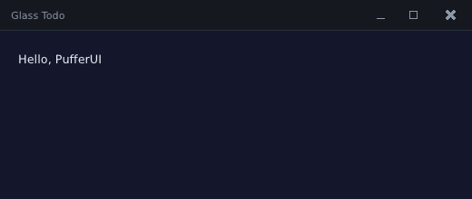

# 1. Setup

Goal: build the library, run the examples that ship with it, then create your own
project that opens a window.

← [Tutorial index](README.md) · next: [2. The frame loop and layout](02-frame-loop-and-layout.md)

## What you need

| Tool | Why | Notes |
|---|---|---|
| A C++20 compiler | PufferUI uses designated initializers and `std::span` | MSVC (Visual Studio 2022 or newer, workload **Desktop development with C++**), or gcc / clang on Linux |
| CMake 3.21+ | the build | comes with Visual Studio; `apt install cmake` on Linux |
| Ninja | the generator the project's presets use | bundled with Visual Studio; `apt install ninja-build` on Linux |
| Git | the repository and its SDL3 submodule | |

PufferUI draws through **SDL3**, which the repository carries as a git submodule
and builds for you — you do not install SDL yourself.

> **Platforms.** Windows (MSVC) is the primary platform and the one this
> tutorial was written and checked on. Linux (gcc and clang) has a CI job that
> builds the library and runs its headless and offscreen test suites; macOS has a
> CMake preset but no CI job, so treat it as "should work, not verified".

**Linux only:** SDL3 needs a few development packages to build with window
support (this is the list CI installs):

```sh
sudo apt-get install -y ninja-build clang libasound2-dev libpulse-dev libx11-dev \
    libxcursor-dev libxrandr-dev libxi-dev libxext-dev libxfixes-dev \
    libwayland-dev libxkbcommon-dev libegl1-mesa-dev
```

## Get the code

```sh
git clone --recursive <repository-url> pufferui
cd pufferui
```

`--recursive` fetches the SDL3 submodule. If you forgot it, the first build stops
complaining that `vendored/SDL` is empty; fix it with

```sh
git submodule update --init --recursive
```

## Build the library and run the tour

On **Windows**, open **Developer PowerShell for VS** (Start menu). It sets up the
compiler's environment; a plain PowerShell does not know where `cl.exe` is, and
the CMake presets use it.

```powershell
cmake --preset x64-release
cmake --build out/build/x64-release --target pui_tour
.\out\build\x64-release\Release\pui_tour.exe
```

On **Linux or macOS**:

```sh
cmake -B build -G Ninja -DCMAKE_BUILD_TYPE=Release
cmake --build build --target pui_tour
./build/Release/pui_tour
```

The first build compiles SDL3 and takes a few minutes; later builds only compile
what you changed. `pui_tour` is a guided app that walks through every capability —
click around, press Up/Down to change chapters. The library's own
[README](../../README.md) is the long reference; this tutorial is the guided path.

### See what you are about to build

The finished app is a CMake target too:

```sh
cmake --build out/build/x64-release --target pui_tut_todo
out/build/x64-release/Release/pui_tut_todo.exe
```

Type a task and press Enter. Close the window, run it again: your tasks are back
(they are saved to `todos.txt` next to where you ran it).

## Create your own project

The tutorial's programs live inside the repository so that CI can build them, but
you build them the way any application would: your project **contains** PufferUI
as a subdirectory and links one target.

```
my_todo/
├── CMakeLists.txt
├── main.cpp
└── pufferui/          <- a clone (or `git submodule add <repository-url> pufferui`)
```

If you use a submodule, remember its nested SDL3 submodule:
`git submodule update --init --recursive`.

`CMakeLists.txt` (this exact file, in the repository as
`docs/tutorial/template/CMakeLists.txt`, was built into a window as part of
writing this chapter):

<!-- src: docs/tutorial/template/CMakeLists.txt -->
```cmake
cmake_minimum_required(VERSION 3.21)
project(glass_todo CXX)

set(CMAKE_CXX_STANDARD 20)
set(CMAKE_CXX_STANDARD_REQUIRED ON)

# PufferUI lives in ./pufferui (a clone or a git submodule). EXCLUDE_FROM_ALL keeps
# its examples and tests out of your build: only what you link gets compiled.
add_subdirectory(pufferui EXCLUDE_FROM_ALL)

add_executable(glass_todo main.cpp)
target_link_libraries(glass_todo PRIVATE pufferui::sdl3) # core + the SDL3 backend

# Where the bundled fonts live: the directory that contains fonts/.
target_compile_definitions(glass_todo PRIVATE
    PUFFERUI_ASSET_DIR="${CMAKE_CURRENT_SOURCE_DIR}/pufferui/assets")
```

Three lines deserve a word:

* `add_subdirectory(pufferui EXCLUDE_FROM_ALL)` — builds the library as part of
  your project. `EXCLUDE_FROM_ALL` keeps the library's dozens of example and test
  programs out of your build: only what you link gets compiled.
* `target_link_libraries(... pufferui::sdl3)` — the library plus its SDL3
  backend. (`pufferui::pufferui` is the same library without any renderer, for
  tests and headless tools — chapter 8 uses it.)
* `PUFFERUI_ASSET_DIR` — a compile-time path to the folder that contains
  `fonts/`. The bundled DejaVu fonts live in `pufferui/assets/fonts`. If you omit
  it, the library falls back to system fonts (Segoe UI or Arial on Windows), so
  text still shows up — but a bundled font looks the same everywhere, which is
  what you want while following a tutorial.

## Your first window

`main.cpp` for now is the first tutorial program. Copy it:

```powershell
copy pufferui\examples\tutorial\step01_window.cpp main.cpp
```

(`cp` on Linux/macOS.) It is short enough to read whole:

<!-- src: examples/tutorial/step01_window.cpp -->
```cpp
// step01_window.cpp - chapter 1: a window, the frame loop, a titlebar, some text.
//
// The smallest complete program, with the loop written out. From chapter 2 on
// this loop lives in tut.h.
#include <pufferui/pufferui.h>

using namespace pui;

int main()
{
    sdl3_app app;
    if (!sdl3_app_init(app, "Glass Todo", 520, 760, 0, nullptr)) return 1;

    while (sdl3_app_pump(app)) // routes input, keeps the window size current; false = quit
    {
        sdl3_app_tick(app); // advances app.now / app.dt
        begin_frame(app.ctx, *app.win, app.now, app.dt);
        {
            ui u(app.ctx);
            rect page = app.win->area;
            u.draw_rect(page, color{20, 22, 44, 255});      // paint the background
            (void)u.titlebar(*app.win, page, "Glass Todo"); // `page` shrinks by the bar
            u.text(page.pad(20.0f).top_slice(24.0f), "Hello, PufferUI", u.th().text, ALIGN_LEFT);
        }
        end_frame(app.ctx);
        app.surface->present();
    }

    sdl3_app_shutdown(app);
    return 0;
}
```

Build and run, from your `my_todo` folder (Developer PowerShell on Windows):

```sh
cmake -S . -B build -G Ninja -DCMAKE_BUILD_TYPE=Release
cmake --build build
./build/glass_todo            # build\glass_todo.exe on Windows
```

You get a dark window with a titlebar (minimize, maximize, close — and you can
drag it and resize it from the edges) and the words **Hello, PufferUI**:



> A console window opens next to the app on Windows. That is just the process's
> `main()`; ignore it for now.

Two things already worth noticing. The window has **no operating-system
decoration**: PufferUI draws its own titlebar (`u.titlebar(...)`) and asks the
platform for native dragging and edge-resizing, so you get Windows' own snapping
behavior with a titlebar you can style. And the whole program is one `while`
loop that draws everything, every frame. The next chapter explains why that is
the whole trick.

## If something goes wrong

| Symptom | Fix |
|---|---|
| `cl.exe` not found / "No CMAKE_CXX_COMPILER" (Windows) | use **Developer PowerShell for VS**, or run `vcvars64.bat` first |
| `vendored/SDL` is empty, or SDL fails to configure | `git submodule update --init --recursive` |
| Text is missing or the wrong font | `PUFFERUI_ASSET_DIR` should point at the folder that *contains* `fonts/` (no trailing slash). Use an absolute path |
| Linux: SDL reports no video driver | install the `-dev` packages above, delete the build folder and reconfigure |
| Changing an option has no effect | delete the `build` folder; CMake caches options |

## Try it

1. Change the background `color{20, 22, 44, 255}` in `main.cpp` and rebuild.
2. Change the string passed to `u.text(...)`. Make it `"Hello, <your name>"`.
3. Resize and maximize the window. Does the text stay put? (It is anchored to the
   top-left of the page: that is the layout's doing — chapter 2.)
