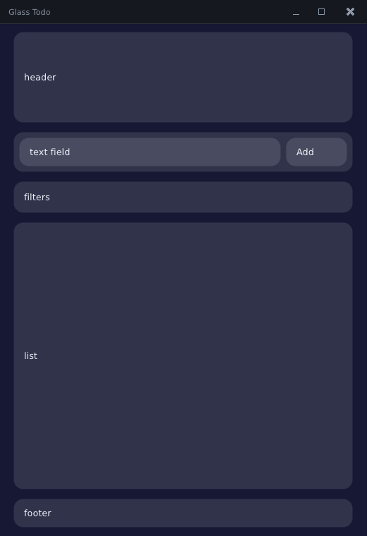

# 2. The frame loop and layout

Goal: understand what "immediate mode" means, read the loop line by line, and lay
the todo page out by cutting rectangles.

← [1. Setup](01-setup.md) · [Tutorial index](README.md) · next: [3. State and widgets](03-state-and-widgets.md)

## Immediate mode in one paragraph

Most GUI toolkits are **retained**: you create widget objects (a `Button`, a
`ListView`), wire up callbacks, and the toolkit keeps the tree alive and redraws
it when something changes. PufferUI is **immediate mode**: there are no widget
objects. Sixty times a second your program runs a function that *describes the
whole UI from your current data*, and the library draws what you described and
reports what the user did to it.

```cpp
// every frame:
if (u.button(rect, "Add", "add"_id))   // draws the button, returns true on the frame it is clicked
    add_task();
u.text(rect, task.title, color, ALIGN_LEFT);   // draws text
```

Consequences you will feel in this tutorial:

* **Your data is the only source of truth.** A checkbox does not own a "checked"
  flag; you pass it `bool &done` and it reads and writes *your* variable. There is
  nothing to synchronize.
* **Conditions are just `if`.** Hide a button by not calling `u.button`. Show a
  list by looping over it.
* **Layout is code.** You compute where things go with ordinary arithmetic, then
  hand each widget a rectangle. That is what the rest of this chapter is about.
* **It is cheap.** Drawing is batched (the whole benchmark scene — thousands of
  widgets — is two draw calls), and when nothing is animating the loop can sleep.

## The loop, line by line

Here is the whole first program's loop again (chapter 1's `step01_window.cpp`):

<!-- src: examples/tutorial/step01_window.cpp -->
```cpp
sdl3_app app;
if (!sdl3_app_init(app, "Glass Todo", 520, 760, 0, nullptr)) return 1;

while (sdl3_app_pump(app)) // routes input, keeps the window size current; false = quit
{
    sdl3_app_tick(app); // advances app.now / app.dt
    begin_frame(app.ctx, *app.win, app.now, app.dt);
    {
        ui u(app.ctx);
        rect page = app.win->area;
        u.draw_rect(page, color{20, 22, 44, 255});      // paint the background
        (void)u.titlebar(*app.win, page, "Glass Todo"); // `page` shrinks by the bar
        u.text(page.pad(20.0f).top_slice(24.0f), "Hello, PufferUI", u.th().text, ALIGN_LEFT);
    }
    end_frame(app.ctx);
    app.surface->present();
}

sdl3_app_shutdown(app);
```

Walking through it:

| Line | What it does |
|---|---|
| `sdl3_app app;` | A struct that will own everything the program needs: the SDL window, the renderer, the library's `context`, the main `window`. |
| `sdl3_app_init(app, title, w, h, 0, nullptr)` | Creates all of that: a borderless, resizable window with native dragging/resizing, a renderer, the library context, a base theme, a font, the clipboard. Returns `false` on failure. |
| `sdl3_app_pump(app)` | Receives the operating system's events (mouse, keys, text, resize, close) and hands them to the library, then reports whether to keep running. It returns `false` when the user closes the window. |
| `sdl3_app_tick(app)` | Reads the clock and fills `app.now` (seconds since start) and `app.dt` (seconds since the last frame). Animations use these. |
| `begin_frame(app.ctx, *app.win, app.now, app.dt)` | Opens a frame for one window: the events collected since last frame become this frame's input. |
| `ui u(app.ctx);` | The object you draw with. It lives for one frame; make it on the stack inside the frame, as shown. |
| *your drawing* | Everything between `begin_frame` and `end_frame`. |
| `end_frame(app.ctx)` | Flushes the batched geometry to the renderer and closes the frame. |
| `app.surface->present()` | Shows the finished image. |
| `sdl3_app_shutdown(app)` | Destroys everything in the right order. |

Three rules that follow from this shape:

1. **Draw only between `begin_frame` and `end_frame`.** Widgets need an open frame.
2. **`ui u` is scoped inside the frame.** Make it inside braces so it is gone
   before `end_frame`.
3. **Anything with a destructor that "holds" something (a scroll view, an id
   scope) must also be gone before `end_frame`** — scope it in braces. The library
   checks this and reports it (chapter 8).

### The frame, as a picture

```
 OS events ──► sdl3_app_pump ──► [window input queue]
                                         │
        ┌────────── begin_frame ◄────────┘      (input becomes "this frame's input")
        │
        │   you:  u.text(...)  u.button(...)  glass_card(...)  ...   ──► draw list (batched)
        │            ▲                │
        │            └── results ◄────┘   (button clicked? checkbox toggled?)
        │
        └────────── end_frame ──► renderer ──► present
```

## Coordinates and rectangles

All sizes are in pixels, with the origin at the **top-left** and **y growing
down**. The window's drawable area is `app.win->area`, a `rect` `{0, 0, w, h}`.

A `rect` is four floats: `x, y, w, h`. Every widget takes one telling it where to
live. So building a layout means producing rectangles, and the library's way of
producing them is **cutting**.

### Cutting

`cut_top(h)`, `cut_bottom(h)`, `cut_left(w)` and `cut_right(w)` **remove** a strip
from a rect and **return** it:

```cpp
rect area = {20, 20, 320, 200};

rect top    = area.cut_top(40);     // top = {20,20,320,40}   area is now {20,60,320,160}
rect bottom = area.cut_bottom(30);  // bottom = {20,190,320,30}  area is now {20,60,320,130}
rect left   = area.cut_left(90);    // left = {20,60,90,130}   area is now {110,60,230,130}
rect right  = area.cut_right(90);   // right = {250,60,90,130}  area is now {110,60,140,130}
rect rest   = area;                 // what is left in the middle
```

Think of a rect as a loaf and a cut as slicing a piece off: what you cut is yours,
what remains is still `area`. Because every cut is arithmetic on a value, layout
has **no hidden state and no layout pass** — what you cut is what you get, and
printing a rect tells you exactly what happened.

Some friends:

| | |
|---|---|
| `r.pad(8)` / `r.pad(x, y)` / `r.pad(l, t, r, b)` | a copy shrunk on each side |
| `r.top_slice(h)`, `r.bottom_slice(h)`, … | a strip *without* modifying `r` |
| `r.cut_top_ratio(0.25)` | cut a quarter instead of pixels |
| `r.align_center(in)`, `align_right(in)`, … | place a rect of this size inside another |
| `r.contains(x, y)` | hit test |

Two guarantees make cutting safe to use without worrying:

* **A cut never returns a negative size.** Asking for more than remains returns
  what is left (and zero once nothing remains). Shrink the window until things
  vanish and nothing breaks.
* **You cannot cut a temporary.** `page.content().cut_top(20)` — cutting a copy
  that is immediately thrown away, the classic way to lose a slice — is a
  *compile error*. Put the rect in a variable first.

### `column` and `row`: cursors

Cutting by hand and adding gaps gets repetitive, so `column` (top to bottom) and
`row` (left to right) wrap a rect and hand out slices with a gap between them:

```cpp
column col(content, 14.0f);      // 14 px between slices
rect header = col.next(128.0f);  // the next 128 px
rect input  = col.next(56.0f);
rect footer = col.cut_bottom(40.0f);  // take from the *bottom* end instead
rect list   = col.remaining();        // everything that is left
```

`next` clamps like a cut: once the space is used up you get zero-size rects, so a
loop that keeps asking just produces nothing. (There is also `track_row` /
`track_column`, which resolve CSS-grid-like `fixed` / `flex` / `ratio` sizes, and
`auto_fit_grid` for card grids; the library README covers them. This app does not
need them.)

## `tut.h`: the loop, packaged

From here on the loop lives in a small helper so each step can show only the UI.
It is the same code as `step01_window.cpp`, plus fonts, a theme, and three
test-friendly flags. The part that matters:

<!-- src: examples/tutorial/tut.h -->
```cpp
template <typename FrameFn> void tut_loop(tut_app &app, FrameFn &&build)
{
    while (sdl3_app_pump(app.boot))
    {
        if (app.selftest && app.frame >= app.selftest_frames) break;
        sdl3_app_tick(app.boot);
        app.now = app.boot.now;
        app.dt = app.boot.dt;
        if (app.selftest && app.script) app.script(app, app.frame);

        begin_frame(app.ctx, *app.win, app.now, app.dt);
        {
            ui u(app.ctx);
            build(u);
            // A contract violation (duplicate id, bad slice, ...) is shown on
            // screen instead of only logged: handy while you learn the library.
            if (!app.selftest)
                draw_violation_overlay(u, rect::make(8.0f, app.height() - 40.0f, 360.0f, 32.0f));
        }
        end_frame(app.ctx);
        app.boot.surface->present();
        ++app.frame;
    }
}
```

and a program using it looks like this (`step02_layout.cpp`'s `main`):

<!-- src: examples/tutorial/step02_layout.cpp -->
```cpp
int main(int argc, char **argv)
{
    tut_app app;
    if (!tut_init(app, "Glass Todo", 520, 760, argc, argv)) return 1;
    tut_loop(app, [&](ui &u) { draw_page(u, app); });
    return tut_shutdown(app);
}
```

`tut_init` opens the window (and adds a bold font), `tut_loop` runs the loop,
`tut_shutdown` cleans up and returns the exit code. `tut_loop` calls your lambda
once per frame with the `ui` to draw into. It also draws the **violation
overlay**: if your code ever breaks one of the library's rules, a red strip tells
you which (chapter 8).

## Laying out the page

The todo app's page is one centered column, at most 480 px wide, with five
regions stacked: a header card, the input row, the filter bar, the list (which
takes all remaining height), and a footer. `step02_layout.cpp` lays them out with
placeholders so you can see the cuts:

<!-- src: examples/tutorial/step02_layout.cpp -->
```cpp
static void draw_page(ui &u, tut_app &app)
{
    rect page = app.win->area; // the whole client area: {0, 0, width, height}
    u.draw_rect(page, color{22, 24, 52, 255});
    (void)u.titlebar(*app.win, page, "Glass Todo"); // cuts the titlebar off `page`

    // One centered column, at most 480 px wide.
    const f32 w = min2(page.w - 32.0f, 480.0f);
    rect content =
        rect::make(page.x + (page.w - w) * 0.5f, page.y + 12.0f, w, max2(0.0f, page.h - 24.0f));

    // A `column` hands out slices from the top, leaving a 14 px gap between them.
    column col(content, 14.0f);
    block(u, col.next(128.0f), "header");

    // The input row: take the button off the right edge, the field gets the rest.
    const rect input = col.next(56.0f);
    block(u, input, "");
    rect in = input.pad(8.0f);
    const rect add_button = in.cut_right(86.0f);
    (void)in.cut_right(8.0f);
    block(u, in, "text field");
    block(u, add_button, "Add");

    block(u, col.next(44.0f), "filters");
    const rect footer = col.cut_bottom(40.0f); // take the footer off the bottom ...
    block(u, col.remaining(), "list");         // ... and give the list everything left
    block(u, footer, "footer");
}
```



Read it top to bottom as a series of cuts:

1. **`page = app.win->area`** — start with the whole window.
2. **`u.titlebar(*app.win, page, ...)`** draws the titlebar *and shrinks `page`*
   by the bar's height (the function takes `rect &`), so everything below can just
   use `page` without knowing the bar exists.
3. **The centered column**: width is `min(page.w - 32, 480)`, x is centered, with
   a 12 px margin top and bottom. Resize the window: wider than 512 px and the
   column stays 480; narrower and it shrinks, keeping 16 px on each side.
4. **A `column` slices it.** `header`, `input`, `filters` are fixed heights.
   `col.cut_bottom(40)` takes the footer off the bottom; `col.remaining()` is the
   list, which stretches to fit.
5. **The input row** is a hand cut: take the 86 px button off the right edge,
   skip 8 px, and the field gets the rest.

Notice what is *not* here: no layout constraints, no flex-grow, no sizing pass.
When something must take "the rest", it is the *last* thing you ask for.

> **Tip: when a layout looks wrong, draw the rects.** `u.draw_rounded_rect(r,
> color{255,0,0,60}, 0)` over a suspect rect shows you exactly where it is. The
> placeholder blocks above are this technique, kept.

## Try it

1. Run `pui_tut_step02_layout` and resize the window narrow, then wide.
2. Make the footer 60 px instead of 40. Which block changes besides the footer?
   (Only the list: it is `remaining()`.)
3. Add a fixed 80 px "sidebar" at the left of the list region with
   `row`/`cut_left`, drawing it with `block(...)`.
4. Put the header and input side by side: replace the two `col.next` calls with a
   `row` over a 128 px slice. Hint: `row r(col.next(128), 14);` then `r.next(w)`.
5. Try to write `page.pad(10).cut_top(20);` on one line. Read the compiler's
   message — that is the guard against cutting a temporary.
