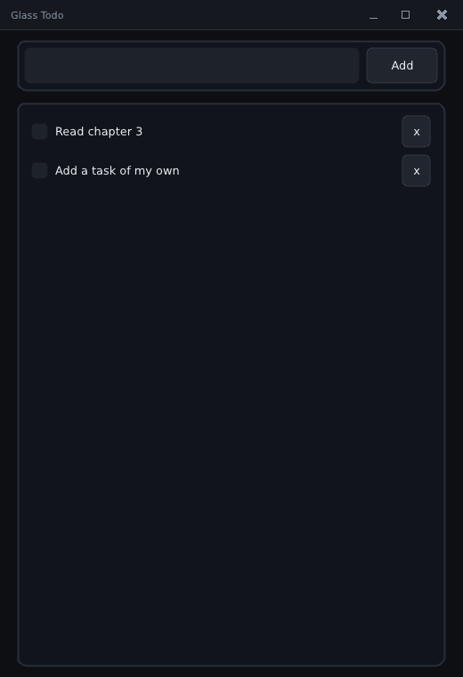

# 3. State and widgets

Goal: model the tasks as plain data, then build the working core of the app — a
text field, an Add button, and a scrolling list with checkboxes and delete
buttons. Still the default dark theme; the point here is how data flows.

← [2. The frame loop and layout](02-frame-loop-and-layout.md) · [Tutorial index](README.md) · next: [4. Views and components](04-views-and-components.md)

Program: `step03_tasks.cpp`. Run it with `pui_tut_step03_tasks`.



## The model: data with no UI in it

Start with what the app *is*, independent of how it looks. `todo_model.h` is plain
C++ — structs and free functions, no PufferUI types:

<!-- src: examples/tutorial/todo_model.h -->
```cpp
struct todo_item
{
    unsigned id = 0; // stable identity: the UI keys widgets and animations by it
    std::string title;
    bool done = false;
};
    // ...
struct todo_list
{
    std::vector<todo_item> items;
    unsigned next_id = 1;
};
    // ...
inline bool todo_add(todo_list &list, const std::string &title)
{
    const size_t a = title.find_first_not_of(" \t");
    if (a == std::string::npos) return false;
    const size_t b = title.find_last_not_of(" \t");
    list.items.push_back({list.next_id++, title.substr(a, b - a + 1), false});
    return true;
}
    // ...
inline void todo_remove(todo_list &list, unsigned id)
{
    for (size_t i = 0; i < list.items.size(); ++i)
    {
        if (list.items[i].id == id)
        {
            list.items.erase(list.items.begin() + static_cast<std::ptrdiff_t>(i));
            return;
        }
    }
}
```

Two details matter later:

* **`id` is stable identity.** A task's position in the vector changes when
  something before it is deleted; its `id` never does. The UI uses the id to tell
  widgets (and later, animations) apart. Never use the vector index for that.
* **The model knows nothing about the screen.** That is what lets chapter 8 test
  it without a window.

## One state struct per screen

The UI needs a little state of its own beyond the model: what is typed in the
field. Keep it all in one struct that you own:

<!-- src: examples/tutorial/step03_tasks.cpp -->
```cpp
struct app_state
{
    todo_list list;    // the tasks (todo_model.h)
    std::string draft; // what is typed in the input field
};
```

`app_state` lives in `main`, and the frame function receives it by reference. There
is no global and no framework-owned store. This is the shape of *every* PufferUI
screen: **state in, frame out, widgets write back.**

## Identity: every widget has an id

Immediate mode has a puzzle to solve. If the library keeps no widget objects, how
does it know that the `text_field` you draw this frame is the *same* one as last
frame — the one that has focus, with the caret at position 7? Answer: **you give
every widget an id**, and the library keeps its small bits of per-widget state
(focus, caret, scroll offset, animation progress) in tables keyed by it.

```cpp
u.text_field(r, s.draft, "draft"_id);
u.button(add_r, "Add", "add"_id);
```

`"draft"_id` is a string literal turned into a 64-bit hash at compile time — free
at run time, readable in code. A few rules:

* **Same widget, same id, every frame.** Change the id and the widget "forgets"
  itself (focus is lost, an animation restarts).
* **Different widgets need different ids.** Two widgets sharing an id share
  focus and state. In debug builds the library catches the common mistake — the
  same id used at two different places in one frame — and reports it (you will
  provoke it in the exercises).
* **Ids are explicit, never derived from the label.** Labels change ("3 items" →
  "4 items") and repeat ("Delete" ×20); ids should not. PufferUI makes you choose.

### Ids inside a loop

A list draws many rows from the same code, so a literal like `"check"_id` would
collide across rows. The answer is an **id scope**: while it is alive, every id
derived inside it is nested under the scope's key.

```cpp
id_scope scope = uu.scope(t.id);                       // this task's own namespace
uu.checkbox(in, t.title, t.done, uu.local("check"));   // "check" inside task #7's scope
```

`u.scope(key)` opens the scope (it closes at the end of the block), and
`u.local("name")` makes an id for `name` *within the current scope*. Row 7's
checkbox and row 8's checkbox now have different ids, because the scope key —
`t.id`, the stable task id from the model — is different. (This is why the id
exists in the model.)

## The input row

<!-- src: examples/tutorial/step03_tasks.cpp -->
```cpp
static void draw_input(ui &u, rect r, app_state &s)
{
    u.card(r);
    rect in = r.pad(8.0f);
    const rect add_r = in.cut_right(80.0f);
    (void)in.cut_right(8.0f);

    // text_field edits `s.draft` in place. It has no "submitted" result, so
    // remember whether it had focus before the call and look for Enter after.
    const bool was_focused = u.ctx->focus == "draft"_id;
    (void)u.text_field(in, s.draft, "draft"_id);
    bool submit = u.button(add_r, "Add", "add"_id);
    if (was_focused && u.key_pressed(key::ENTER)) submit = true;

    if (submit && todo_add(s.list, s.draft))
    {
        s.draft.clear();
        u.ctx->focus_request = "draft"_id; // put the caret back in the field
    }
}
```

Reading it:

* **`u.card(r)`** draws the themed rounded panel the row sits on.
* **The cuts**: `r.pad(8)` leaves a margin; `in.cut_right(80)` removes the Add
  button's rect from the right edge; `cut_right(8)` removes the gap. `in` — what
  is left — is the field. (`(void)` marks a deliberately discarded slice: cuts are
  `[[nodiscard]]` so you do not drop one by accident.)
* **`u.text_field(in, s.draft, id)`** edits `s.draft` *in place*. Click and it
  takes focus and puts the caret where you clicked; it handles selection,
  copy/paste, undo, and the keyboard. It returns `true` when the text changed.
* **`u.button(rect, label, id)`** draws the button and returns `true` **only on
  the frame it is clicked**. That is the whole event model: a click is an `if`.
* **Enter to submit.** A text field has no "submitted" result — it commits (and
  loses focus) when you press Enter. So the code asks, *before* calling the field,
  whether it already had focus (`u.ctx->focus == "draft"_id`), then checks
  whether Enter was pressed this frame (`u.key_pressed(key::ENTER)`). Both
  conditions together mean "Enter was pressed inside the field".
* **`u.ctx->focus_request = id`** asks for keyboard focus on that widget, applied
  at the start of the next frame. After adding a task the code requests focus back
  on the field so you can keep typing.

`todo_add` returns `false` for an empty title, so pressing Enter on an empty field
does nothing. All the validation lives in the model, where a test can reach it.

## The list

<!-- src: examples/tutorial/step03_tasks.cpp -->
```cpp
static void draw_tasks(ui &u, rect r, app_state &s)
{
    u.card(r);
    unsigned remove_id = 0; // deleting inside the loop would invalidate it

    {
        // A scroll_view clips to its viewport and scrolls its content;
        // virtual_list only builds the rows that are on screen.
        scroll_view sv = u.scroll(r.pad(6.0f), "list"_id);
        sv.virtual_list(static_cast<i32>(s.list.items.size()), ROW_H,
                        [&](ui &uu, i32 i, rect row)
                        {
                            todo_item &t = s.list.items[static_cast<size_t>(i)];
                            // Widget ids are explicit hashes. Inside a loop, a scope
                            // makes "check" and "del" unique per task.
                            id_scope scope = uu.scope(t.id);
                            rect in = row.pad(6.0f, 4.0f);
                            const rect del_r = in.cut_right(32.0f);
                            (void)uu.checkbox(in, t.title, t.done, uu.local("check"));
                            if (uu.button(del_r, "x", uu.local("del"))) remove_id = t.id;
                        });
    }
    if (remove_id != 0) todo_remove(s.list, remove_id);
}
```

The interesting parts:

**`scroll_view`.** `u.scroll(viewport, id)` returns an object that clips drawing to
the viewport, applies the scroll offset to everything drawn while it is alive,
handles the mouse wheel and the draggable scrollbar, and keeps the offset keyed by
its id. It is an **RAII scope**: it is active until the variable goes out of scope.
That is why the loop sits in its own `{ }` block — the scope must end before the
code after it draws (and before `end_frame`).

**`virtual_list`.** `sv.virtual_list(count, row_height, fn)` calls `fn` only for
the rows that intersect the viewport, handing each its rect, and works out the
total content height itself. Ten thousand tasks cost the same to draw as ten. (If
your rows have different heights, use `sv.content()` with your own cursor and call
`sv.set_content_height(...)` instead.)

**The lambda** `[&](ui &uu, i32 i, rect row) {...}` is the row. It receives its
own `ui &uu` (use that, not the outer `u`, inside it).

**Deferred deletion.** Clicking a row's delete button must remove the task — but
the loop is in the middle of walking `s.list.items`. Erasing from a vector while
iterating over it is a bug. So the button only *records* the id
(`remove_id = t.id`) and the removal happens after the scope closes. This
"record now, apply after" pattern is how you mutate a collection from inside the
UI that is drawing it.

**`checkbox`.** `uu.checkbox(rect, label, bool &value, id)` draws a box and a
label, flips `value` when clicked (or on Space/Enter when focused), and returns
`true` on the frame it changed. `t.done` *is* the checkbox's state.

## Run it

`main` seeds two tasks so the list is not empty, then runs the loop with the page
function:

<!-- src: examples/tutorial/step03_tasks.cpp -->
```cpp
int main(int argc, char **argv)
{
    tut_app app;
    if (!tut_init(app, "Glass Todo", 520, 760, argc, argv)) return 1;

    app_state state;
    todo_add(state.list, "Read chapter 3");
    todo_add(state.list, "Add a task of my own");

    tut_loop(app, [&](ui &u) { draw_page(u, app, state); });
    return tut_shutdown(app);
}
```

Type something, press Enter. Click a checkbox. Press **Tab** — focus moves
through the field, the Add button, the checkboxes and delete buttons in the order
they were drawn, and Space or Enter activates the focused one. You got keyboard
navigation without writing any.

## What you learned

| Idea | One line |
|---|---|
| State | one struct you own; widgets take references to your fields |
| Events | a function's return value: `if (u.button(...))` |
| Identity | an explicit id per widget; `u.scope` + `u.local` inside loops |
| Focus | `ctx->focus` is who has it; `ctx->focus_request` asks for it |
| Lists | `scroll` + `virtual_list`; record deletions, apply them after |

## Try it

1. Make the model refuse titles shorter than three characters: the check
   belongs in `todo_add` (in `todo_model.h`), not in the UI, and the UI needs no
   change at all.
2. **Provoke a violation.** In `draw_tasks`, replace `uu.local("del")` with the
   literal `"del"_id` and run a debug build with two tasks. A red strip appears:
   *duplicate widget id*. Put it back. (More on this in chapter 8.)
3. Show the task id next to each title: `uu.textf(..., "#%u", t.id)` — and watch it
   stay with its task as you delete the one above it.
4. Change `ROW_H` to `64.0f`. Everything — hit areas, scrolling, culling — follows
   because they all use the same number.
5. Add 300 tasks at startup in `main` (a loop calling `todo_add`). Scroll. Is it
   still smooth?
