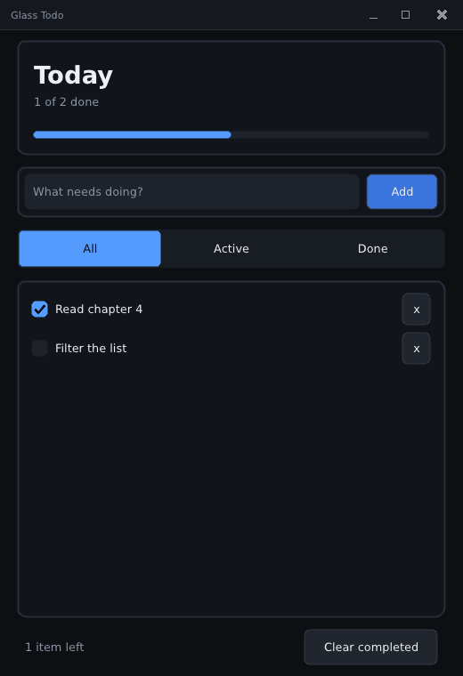

# 4. Views and components

Goal: finish the app's *features* — a header with live counts, a filter, an empty
state, a footer — and learn how views, text styles, themes and the library's
ready-made components fit together. Still the default theme: next chapter is the
glass.

← [3. State and widgets](03-state-and-widgets.md) · [Tutorial index](README.md) · next: [5. Liquid glass](05-liquid-glass.md)

Program: `step04_filters.cpp`. Run it with `pui_tut_step04_filters`.



## Derive the view, don't store it

The list must show only the tasks the filter lets through. The tempting design is
a second vector, "visible tasks", kept in sync with the first. Don't. Anything
that can be computed from the model should be **computed each frame** — it is
cheap, and it can never be stale:

<!-- src: examples/tutorial/step04_filters.cpp -->
```cpp
// The view: indices of the tasks the filter lets through, rebuilt each frame.
std::vector<size_t> shown;
for (size_t i = 0; i < s.list.items.size(); ++i)
    if (todo_visible(s.list.items[i], s.filter)) shown.push_back(i);
```

The result, `shown`, is a list of *indices into the model*, rebuilt every frame.
Toggle a checkbox and the very next frame's `shown` already reflects it; there is
no refresh step to forget. The row callback then reaches the real task through the
index (`s.list.items[shown[i]]`), so a checkbox still writes the actual `done`
field.

(The library's own docs call this the *state/view* pattern: the model is written
directly by widgets, and anything derived is computed fresh for display.)

## Text styles: font and size per scope

The header shows "Today" large and bold. `u.text_style(size, font)` returns a
scope object: every piece of text drawn while it is alive uses that size and font,
then the previous style comes back.

<!-- src: examples/tutorial/step04_filters.cpp -->
```cpp
static void draw_header(ui &u, rect r, const app_state &s)
{
    const theme &th = u.th();
    u.card(r);
    rect in = r.pad(18.0f);
    {
        // text_style changes the font and size for text drawn while it is alive
        text_scope big = u.text_style(32.0f, s.bold);
        u.text(in.cut_top(40.0f), "Today", th.text, ALIGN_LEFT);
    }
    const i32 total = static_cast<i32>(s.list.items.size());
    if (total == 0)
        u.text(in.cut_top(22.0f), "Nothing planned yet", th.text_dim, ALIGN_LEFT);
    else
        u.textf(in.cut_top(22.0f), th.text_dim, ALIGN_LEFT, "%d of %d done",
                todo_count_done(s.list), total);
    const f32 frac =
        total ? static_cast<f32>(todo_count_done(s.list)) / static_cast<f32>(total) : 0;
    const rect bar = in.bottom_slice(8.0f);
    u.draw_rounded_rect(bar, th.widget_bg, 4.0f);
    if (frac > 0.0f)
        u.draw_rounded_rect(rect::make(bar.x, bar.y, max2(bar.h, bar.w * frac), bar.h), th.accent,
                            4.0f);
}
```

* **The `{ }` around `text_scope` is the scope.** Forget the braces and the whole
  rest of the function is drawn at 32 px.
* **`u.textf`** is `printf` for text: `u.textf(rect, color, align, "%d of %d done",
  done, total)`. (Plain `u.text` takes a `std::string_view`.)
* **Size numbers are the pixel height of the whole font box** (ascent plus
  descent), so letters look a bit smaller than the number suggests: `18` is
  comfortable body text, `32` a headline.
* **The progress bar is two rounded rects:** a track, and a fill whose width is
  `bar.w * fraction`. A radius of half the height makes it a pill. (Chapter 6 makes
  the fill animate.)
* **Colors come from the theme** (`th.text`, `th.text_dim`, `th.widget_bg`,
  `th.accent`) rather than being hard-coded, so the next chapter can restyle
  everything by swapping the theme.

## A ready-made component

The three-way filter is `comp::segmented`, one of the library's *components* in
the `pui::comp` namespace:

<!-- src: examples/tutorial/step04_filters.cpp -->
```cpp
static void draw_filters(ui &u, rect r, app_state &s)
{
    static const char *const labels[] = {"All", "Active", "Done"};
    // comp::segmented is one of the library's ready-made components: it reads
    // and writes `s.filter` and needs an explicit id like every widget.
    (void)comp::segmented(u, r, labels, s.filter, {.id = "filter"_id});
}
```

Every component follows one convention, which is worth learning once:

```cpp
result = comp::name(u, area_rect, ...data..., { .id = "unique"_id, ...options });
```

* the **rect** says where; the component only paints inside it
* the **data** (`s.filter`) is a reference to *your* variable — the component writes it
* the **last argument** is a small options struct, written with designated
  initializers; `.id` is required
* the **result** is a struct that converts to `bool` ("something changed"), with
  details like the selected index

Others you have for free: `switch_toggle`, `radio_group`, `tab_bar`,
`accordion_scope`, `drawer_scope`, `table`, `command_palette`, `toast_draw`,
`section`. They read their colors from slots in the theme (`theme.segmented`,
`theme.tabs`, ...), and you can restyle one instance by copying the theme's style
struct, editing it, and passing its address as `.style = &mine`:

```cpp
segmented_style mine = u.th().segmented;
mine.selected = color{255, 160, 60, 255};
comp::segmented(u, r, labels, s.filter, {.id = "filter"_id, .style = &mine});
```

## The empty state

When nothing passes the filter, show a message instead of a blank card — and make
it honest about *why* the list is empty:

<!-- src: examples/tutorial/step04_filters.cpp -->
```cpp
if (shown.empty()) // the empty state
{
    rect text_r = rect::make(r.x + 20.0f, r.center_y() - 24.0f, r.w - 40.0f, 60.0f);
    {
        text_scope ts = u.text_style(20.0f, s.bold);
        u.text(text_r.cut_top(28.0f), "All clear", th.text, ALIGN_CENTER);
    }
    u.text(text_r.cut_top(22.0f),
           s.list.items.empty() ? "Add a task above to get started."
                                : "No tasks match this filter.",
           th.text_dim, ALIGN_CENTER);
    return;
}
```

`ALIGN_CENTER` centers each line inside the rect it is given. The two cuts
(`cut_top(28)`, `cut_top(22)`) hand out two lines of text from one small rect.
Notice that nothing here needed a "visibility" flag: the `if` *is* the logic.

## The footer, and conditional widgets

<!-- src: examples/tutorial/step04_filters.cpp -->
```cpp
static void draw_footer(ui &u, rect r, app_state &s)
{
    rect in = r.pad(8.0f, 0.0f);
    const i32 left = static_cast<i32>(s.list.items.size()) - todo_count_done(s.list);
    const rect clear_r = in.cut_right(150.0f);
    u.textf(in, u.th().text_dim, ALIGN_LEFT, "%d item%s left", left, left == 1 ? "" : "s");
    if (todo_count_done(s.list) > 0 && u.button(clear_r, "Clear completed", "clear"_id))
        todo_clear_done(s.list);
}
```

"Clear completed" only exists while there is something to clear. In a retained
toolkit you would hide and show a button object; here the button simply is not
drawn on frames where the condition is false (`&&` short-circuits, so
`u.button(...)` is not even called).

## A placeholder, drawn by hand

The text field has no placeholder property, but immediate mode makes one trivial:

<!-- src: examples/tutorial/step04_filters.cpp -->
```cpp
if (s.draft.empty() && u.ctx->focus != "draft"_id) // a placeholder, drawn by hand
    u.text(in.pad(u.th().padding * 0.5f + 2.0f, 0.0f), "What needs doing?", u.th().text_dim,
           ALIGN_LEFT);
```

Draw dim hint text over the field when it is empty *and* unfocused. Because you
decide what is drawn each frame from the current state, "a feature the library
lacks" is often three lines of your own.

## The theme: one place for the look

So far everything has used `default_dark()`. The theme is a plain struct you own:
colors, radii, spacing, text size, fonts, the button style, and slots for the
components. `main` creates one, adds a **button role**, and installs it:

<!-- src: examples/tutorial/step04_filters.cpp -->
```cpp
// A "primary" button role: a named style that widgets opt into by id.
theme t = default_dark();
t.font = app.font;
set_button_role(t, "primary"_id,
                button_override{.bg = some(color{58, 116, 220, 255}),
                                .hover_bg = some(color{82, 140, 240, 255})});
set_theme(app.ctx, t);
```

* **A role is a named style.** `set_button_role(t, "primary"_id, override)` records
  "buttons asked for as `primary` look like this". At a call site,
  `u.button(r, "Add", "add"_id, "primary"_id)` opts in (the fourth argument is the
  role id). Change the role in one place and every primary button follows.
* **`some(x)`** marks an override as *set*: unset fields fall through to the
  theme's defaults (`opt<T>` is "optional" with a flag).
* **`set_theme(ctx, t)`** copies it in. You can call it again at any time — the
  glass look in chapter 5 is just a different theme.

Overrides cascade, most specific winning: the theme → a role → a `style_scope`
(a scope object restyling every button inside it) → a per-call override.

### Button states: normal, hover, held, focused

A button looks different in each state, and the theme says how. There is no
"on hover" callback to write: every frame the button asks the pointer what it is
doing and picks a color.

| State | When | Where its look comes from |
|---|---|---|
| normal | the pointer is elsewhere | `button_style::bg`, `border`, `text` |
| **hover** | the pointer is over it | `button_style::hover_bg` (and the hand cursor, `theme.button_cursor`) |
| **held** | the button is pressed on it | `button_style::active_bg` |
| focused | it has keyboard focus (Tab) | a ring in `theme.focus_border` |

Set them in the theme, or in a role as the "primary" role above does:

```cpp
set_button_role(t, "primary"_id,
                button_override{.bg = some(color{58, 116, 220, 255}),
                                .hover_bg = some(color{82, 140, 240, 255}),    // lighter on hover
                                .active_bg = some(color{40, 96, 190, 255})});  // darker while held
t.button.transition = transition{.duration = 0.12f, .curve = easing::EASE_OUT};
```

The last line is what makes hover *feel* right: with a `transition`, the color
eases from one state's value to the next over 0.12 s instead of snapping.
A role that sets only `bg` leaves `hover_bg` and `active_bg` at the theme's values,
which rarely match the role's color (the button changes color on hover, just the
wrong one), so **set `hover_bg` and `active_bg` whenever you override `bg`**.
Chapter 6 builds a button from scratch and shows how little a "hover effect" really is.

## What you learned

| Idea | One line |
|---|---|
| Views | compute what the screen shows from the model each frame; do not cache it |
| Text | `u.text` / `u.textf`; `u.text_style(size, font)` scopes a font and size |
| Components | `comp::name(u, rect, data, {.id = ...})` — you own the data, they paint |
| Conditions | a UI feature is an `if` around a call |
| Themes | one struct; roles are named styles; `set_theme` swaps the whole look |
| Button states | `bg` / `hover_bg` / `active_bg` plus a `transition`; set all three together |

## Try it

1. Add a fourth filter, "Long", that shows tasks whose title is longer than 20
   characters: a new `FILTER_LONG` in `todo_model.h`, a case in `todo_visible`,
   one more label in `draw_filters`. Nothing else in the UI changes.
2. Make "Clear completed" use the `"danger"` role. First add a `"danger"` role in
   `main` with a red `bg`.
3. In the header, show `"All done!"` instead of `"N of N done"` when every task is
   complete.
4. Change the progress bar to be 14 px tall, with square ends (radius `0`).
5. Pass `.style = &mine` to the segmented control (see above) so the selected
   pill is orange.
6. Make hover obvious on the primary button: give it a clearly lighter `hover_bg`
   and a darker `active_bg`, add the `transition` line, then hover and press it.
