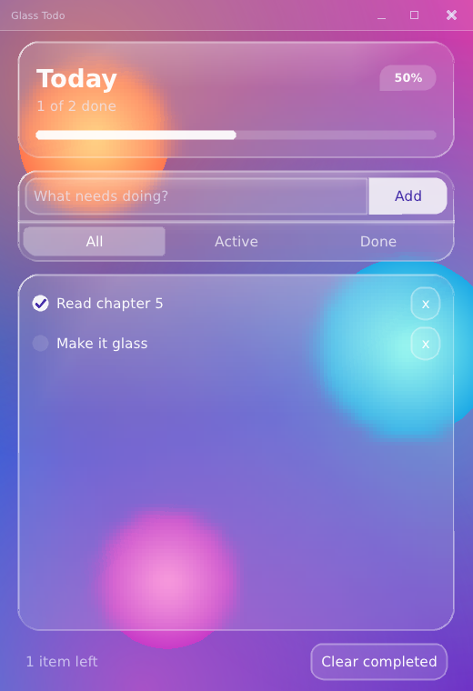
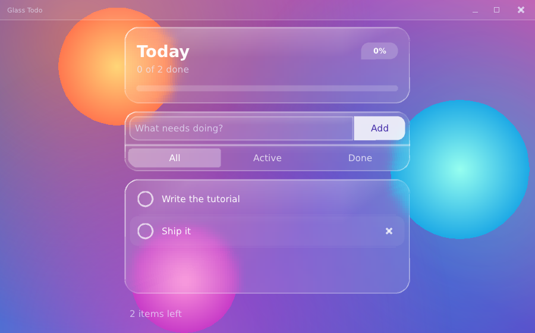
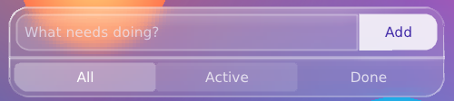

# 5. Liquid glass

Goal: turn chapter 4's plain app into frosted glass over a living-color
background — without changing a single widget. You will build a background, a
glass card, a rim light, and a theme, from the public drawing API.

← [4. Views and components](04-views-and-components.md) · [Tutorial index](README.md) · next: [6. Motion and custom widgets](06-motion-and-custom-widgets.md)

Program: `step05_glass.cpp`, helpers in `glass.h`. Run `pui_tut_step05_glass`.



## What "glass" is made of

A glass card is a stack of five thin layers over a scene. Each is a few lines:

```
   ┌──────────────────────────────┐
   │ 5. rim      a bright hairline whose brightness follows the light
   │ 4. sheen    a soft highlight fading down from the top edge
   │ 3. tint     a translucent white fill (alpha ≈ 13%)
   │ 2. blur     the scene BEHIND the card, smeared
   └──────────────────────────────┘
      1. scene   something colorful worth blurring
```

Glass needs *something to blur*. A flat color blurred is the same flat color, so
layer 1 matters as much as the card. We build it first.

## Layer 1: a scene (vertex colors)

PufferUI's drawing calls (`draw_rect`, `draw_rounded_rect`, `text`, ...) cover most
needs. For a gradient you need the lower-level call:

```cpp
u.draw_triangles(nullptr, vertices, vertex_count, indices, index_count);
```

A `vertex` is `{x, y, u, v, color}`. Passing `nullptr` as the texture means
"solid color", and the renderer **interpolates the vertex colors across each
triangle**. That is a gradient for free: give a quad four different corner colors
and it blends between them.

A **soft glow** is the same trick in a circle: a triangle *fan* with an opaque
color at the center and the same color at **alpha 0** on the rim.

<!-- src: examples/tutorial/glass.h -->
```cpp
inline void glass_glow(ui &u, vec2 center, f32 radius, color c)
{
    constexpr i32 SEG = 40;
    vertex v[SEG + 2];
    i32 idx[SEG * 3];
    v[0] = {center.x, center.y, 0.0f, 0.0f, c};
    color edge = c;
    edge.a = 0;
    for (i32 i = 0; i <= SEG; ++i)
    {
        const f32 a = 2.0f * PI * static_cast<f32>(i) / static_cast<f32>(SEG);
        v[i + 1] = {center.x + std::cos(a) * radius, center.y + std::sin(a) * radius, 0.0f, 0.0f,
                    edge};
    }
    for (i32 i = 0; i < SEG; ++i)
    {
        idx[i * 3 + 0] = 0;
        idx[i * 3 + 1] = i + 1;
        idx[i * 3 + 2] = i + 2;
    }
    u.draw_triangles(nullptr, v, SEG + 2, idx, SEG * 3);
}
```

A **crisp orb** is the same fan with two *opaque* colors (lighter center, darker
edge): it has a visible edge, which is what makes the blur visible later — sharp
outside the card, smeared inside it.

The background is a four-corner gradient quad, three glows, and three orbs.
`time` makes the orbs drift slowly (chapter 6 feeds it the frame clock):

<!-- src: examples/tutorial/glass.h -->
```cpp
inline void glass_background(ui &u, rect r, f64 time)
{
    // four corner colors; the renderer blends between them
    const color tl{66, 52, 214, 255}, tr{214, 64, 168, 255};
    const color bl{18, 128, 220, 255}, br{104, 44, 200, 255};
    vertex v[4] = {{r.x, r.y, 0, 0, tl},
                   {r.right(), r.y, 1, 0, tr},
                   {r.right(), r.bottom(), 1, 1, br},
                   {r.x, r.bottom(), 0, 1, bl}};
    const i32 idx[6] = {0, 1, 2, 0, 2, 3};
    u.draw_triangles(nullptr, v, 4, idx, 6);

    const f32 t = static_cast<f32>(time);
    const f32 s = max2(r.w, r.h);
    glass_glow(u, {r.x + r.w * 0.15f, r.y + r.h * 0.12f}, s * 0.55f, color{255, 150, 70, 170});
    glass_glow(u, {r.x + r.w * 0.90f, r.y + r.h * 0.55f}, s * 0.50f, color{40, 232, 226, 130});
    glass_glow(u, {r.x + r.w * 0.30f, r.y + r.h * 1.00f}, s * 0.55f, color{255, 70, 190, 150});

    glass_orb(u, {r.x + r.w * (0.20f + 0.05f * std::sin(t * 0.30f)), r.y + r.h * 0.20f}, s * 0.11f,
              color{255, 214, 120, 255}, color{255, 120, 80, 255});
    glass_orb(u, {r.x + r.w * 0.86f, r.y + r.h * (0.47f + 0.04f * std::sin(t * 0.26f + 1.0f))},
              s * 0.13f, color{150, 255, 240, 255}, color{30, 170, 230, 255});
    glass_orb(u, {r.x + r.w * (0.30f + 0.06f * std::sin(t * 0.22f + 2.0f)), r.y + r.h * 0.84f},
              s * 0.10f, color{255, 150, 220, 255}, color{200, 60, 200, 255});
}
```

Spend a few minutes tuning this: change the corner colors, the glow alphas, the
orb sizes. A good scene has smooth color *and* a few hard edges. Make the window
wide and the point is unmistakable — each orb is crisp beside the card and a soft
smear inside it:



## Layer 2: blur

The call is one line:

```cpp
u.blur(rect, blur_radius, corner_radius, alpha);
```

What it does, precisely, because this is the part people get wrong:

* **It blurs what has already been drawn.** `blur` copies the part of the window
  under `rect` as it exists *right now*, blurs the copy, and draws the result over
  `rect`. So draw order is the whole story: background first, then `blur`, then
  whatever should sit on top of the glass.
* **`alpha = 1` replaces** the content under the rect with the blurred copy. Lower
  values mix in the sharp original — meant for fade animations, not for glass.
* **`corner_radius` rounds the blurred area**, so a rounded card gets a rounded
  blur with no hard corners. An overload takes a radius *per corner*,
  `u.blur(rect, blur_radius, corner_radii{...}, alpha)` — see "Rounding only some
  corners" below.
* **The radius is approximate and stepwise.** The renderer's only sampling
  primitive is "copy this region, scaled", so blur works by repeatedly shrinking
  and enlarging; the radius picks how deep. Values around 20–30 look soft; below 4
  is subtle.
* **It needs render targets** (`backend_caps::RENDER_TARGETS`). The SDL3 backend
  has them, including its software renderer (which is what `--selftest` uses).
  Without them, `blur` falls back to a flat translucent tint, so a UI never fails to
  draw — it just stops being frosted.
* **A blur ends the current draw batch,** because it must read everything drawn
  before it. A handful of glass cards per frame is cheap; hundreds is not what it
  is for.

Blur alone on a flat panel changes little. The glass reads as glass because of what
sits on top:

## Layers 3–5: tint, sheen, rim

<!-- src: examples/tutorial/glass.h -->
```cpp
struct glass_style
{
    corner_radii radii = corner_radii::all(24.0f); // per-corner radii; 0 = a square corner
    f32 blur = 24.0f;                              // backdrop blur radius (see chapter 5)
    color tint = {255, 255, 255, 34};              // translucent fill over the blur
    f32 sheen = 0.20f;                             // brightness of the top highlight (0 = none)
    color rim_light = {255, 255, 255, 190};        // rim where it faces the light
    color rim_dark = {255, 255, 255, 30};          // rim where it does not
    f32 rim_width = 1.3f;
};
```

`glass_style` is the whole look in one struct (copy it, change a field, pass it).
The card function is short because each layer is one call:

<!-- src: examples/tutorial/glass.h -->
```cpp
inline void glass_card(ui &u, rect r, const glass_style &st = {})
{
    u.blur(r, st.blur, st.radii, 1.0f);        // the blur and the tint share one shape ...
    u.draw_rounded_rect(r, st.tint, st.radii); // ... so square corners stay square
    if (st.sheen > 0.0f)
    {
        // a white-to-clear gradient over the upper part; it also fades out
        // toward both sides so it never shows a hard edge
        const f32 inset_l = st.radii.tl * 0.6f, inset_r = st.radii.tr * 0.6f;
        const rect s = rect::make(r.x + inset_l, r.y + 1.0f, r.w - inset_l - inset_r, r.h * 0.4f);
        const f32 cols[4] = {0.0f, 0.22f, 0.78f, 1.0f}; // x positions across the strip
        const f32 amp[4] = {0.0f, 1.0f, 1.0f, 0.0f};    // brightness at the top row
        vertex v[8];
        for (i32 i = 0; i < 4; ++i)
        {
            const f32 x = s.x + s.w * cols[i];
            v[i] = {x, s.y, 0.0f, 0.0f, fade(color{255, 255, 255, 255}, st.sheen * amp[i])};
            v[4 + i] = {x, s.bottom(), 0.0f, 0.0f, color{255, 255, 255, 0}};
        }
        i32 idx[18];
        for (i32 i = 0; i < 3; ++i)
        {
            const i32 o = i * 6;
            idx[o + 0] = i;
            idx[o + 1] = i + 1;
            idx[o + 2] = 4 + i;
            idx[o + 3] = i + 1;
            idx[o + 4] = 5 + i;
            idx[o + 5] = 4 + i;
        }
        u.draw_triangles(nullptr, v, 8, idx, 18);
    }
    glass_rim(u, r, st);
}
```

**The tint** is a *translucent* white (`alpha 34` of 255). Translucency is the
essential rule: a panel with background alpha ~245 would hide the blur entirely.
Frosted glass is ~10–20% white over the blur.

**The sheen** is a quad with a bright top edge fading to clear at 40% of the
height. It is made of **three quads in a row (eight vertices)** instead of one
because the top corners' alpha fades to zero toward the left and right: with a
single quad its sides showed as hard vertical edges.

**The rim** is the detail that sells it. Real glass edges catch the light
unevenly. We make a thin outline whose brightness depends on which way each piece
of the edge *faces*:

<!-- src: examples/tutorial/glass.h -->
```cpp
vec2 pos[N], nrm[N];
for (i32 c = 0; c < 4; ++c)
{
    for (i32 s = 0; s <= SEG; ++s)
    {
        const f32 a = start[c] + (PI * 0.5f) * static_cast<f32>(s) / static_cast<f32>(SEG);
        const i32 i = c * (SEG + 1) + s;
        nrm[i] = {std::cos(a), std::sin(a)};
        pos[i] = {centers[c].x + nrm[i].x * rad[c], centers[c].y + nrm[i].y * rad[c]};
    }
}
// ...
// ring offsets along the outward normal, and whether the ring is faded out
const f32 offs[RINGS] = {0.7f, 0.0f, -st.rim_width, -st.rim_width - 0.7f};
const bool edge[RINGS] = {true, false, false, true};
vertex v[RINGS * N];
for (i32 k = 0; k < RINGS; ++k)
{
    for (i32 i = 0; i < N; ++i)
    {
        const f32 d = nrm[i].x * -0.7071f + nrm[i].y * -0.7071f; // facing the light?
        const f32 lit = d > 0.0f ? d * d : 0.0f;
        const f32 echo = d < 0.0f ? 0.5f * d * d : 0.0f;
        color c = theme_lerp_color(st.rim_dark, st.rim_light, clampf(lit + echo, 0.0f, 1.0f));
        if (edge[k]) c.a = 0;
        v[k * N + i] = {pos[i].x + nrm[i].x * offs[k], pos[i].y + nrm[i].y * offs[k], 0.0f,
                        0.0f, c};
```

1. Walk around the rounded rectangle in 4 × 9 points (a few per corner arc),
   recording each point and its **outward normal** (the direction the edge faces).
2. Take the **dot product of the normal with the light direction** (up and to the
   left): `d = 1` means "facing the light", `-1` "facing away".
3. `lit = d²` where `d > 0` (bright rim toward the light) plus a weaker `echo` on
   the opposite side (refraction): both squared so the highlight falls off quickly.
4. Blend the color between `rim_dark` and `rim_light` by that amount.
5. Build **four rings** of vertices along each normal — a faded outer edge, the
   bright core, the inner edge of the core, a faded inner edge — and connect
   neighbors with triangles. The faded rings are the anti-aliasing: the edge
   softens over a pixel instead of stair-stepping.

The whole outline is one `draw_triangles` call.

> **Why not `draw_rounded_rect` with an outline?** The library's own outlines are
> one color around the whole shape. The varying brightness around the rim is what
> this adds — and the *only* way to get it is custom vertex colors.

## Knobs

| `glass_style` field | Effect | Try |
|---|---|---|
| `blur` | how smeared the backdrop is | 8 (light frost) … 30 (heavy) |
| `tint` alpha | how white / how readable | 20 (clear) … 60 (milky) |
| `sheen` | strength of the top highlight | 0 turns it off |
| `rim_light`, `rim_dark` | bright and dim ends of the rim | a colored `rim_light` tints the glow |
| `rim_width` | thickness of the bright line | 1 … 2 px |
| `radii` | corner roundness, per corner (`corner_radii::all(24)`, `::top(22)`, `{.tl = 24, .br = 6}`); `0` is a square corner | nested radii look best: inner = outer − padding |

## Rounding only some corners

Sometimes a card should not be rounded all the way around: a panel docked to the
window's bottom edge, two cards that touch and read as one group, a tab hanging
from a bar. PufferUI's rounded shapes take a **radius per corner**:

```cpp
struct corner_radii { f32 tl, tr, br, bl; };   // top-left, top-right, bottom-right, bottom-left

corner_radii::all(16)       // every corner (what a single radius always meant)
corner_radii::top(16)       // round the top corners, square the bottom ones
corner_radii::bottom(16)    // ... or the other way around
corner_radii::left(16), corner_radii::right(16)
corner_radii{.tl = 24, .br = 24}   // any mix; a radius of 0 is a square corner
```

and two calls understand it:

```cpp
u.draw_rounded_rect(r, color, corner_radii::top(16));      // the plain f32 overload still works
u.blur(r, 20.0f, corner_radii::bottom(16), 1.0f);          // the blurred copy follows the same shape
```

Each radius is limited to half the rectangle's shorter side, so neighbors never
overlap. The built-in `button` and `text_field` take per-corner radii too (see
"Widgets that round one side" below); `card`, `panel`, `number_field` and the
`comp::` components still take one radius from the theme.

`glass_style` carries the radii (`radii = corner_radii::all(24)` by default), and
`glass_card` hands the same value to *every* layer that has a shape, which is what
keeps square corners square: the blur and the tint use it directly, the sheen
insets itself by the *top* radii, and the rim walks around the outline with a radius
per corner — a square corner is just an arc of radius 0 that collapses to a point:

<!-- src: examples/tutorial/glass.h -->
```cpp
// corners clockwise from the top-left, each with its own radius (0 = square:
// its arc collapses to the corner point)
const f32 half = min2(r.w, r.h) * 0.5f;
const f32 rad[4] = {clampf(st.radii.tl, 0.0f, half), clampf(st.radii.tr, 0.0f, half),
                    clampf(st.radii.br, 0.0f, half), clampf(st.radii.bl, 0.0f, half)};
// centers of the corner arcs, and the angle each arc starts at
const vec2 centers[4] = {{r.x + rad[0], r.y + rad[0]},
                         {r.right() - rad[1], r.y + rad[1]},
                         {r.right() - rad[2], r.bottom() - rad[2]},
                         {r.x + rad[3], r.bottom() - rad[3]}};
```

### Grouped cards

In the app, the input row and the filter bar are one group. The layout is a plain
cut: carve the group out as one rect, then cut the input off its top. The two cards
then meet with no gap:

<!-- src: examples/tutorial/todo_ui.h -->
```cpp
// The input and the filter bar are one glass group: cut the group out first,
// then cut the input off its top. Rounded at the top and bottom, square where
// they meet.
rect group = col.next(56.0f + 44.0f);
const rect input_r = group.cut_top(56.0f);
todo_input(u, input_r, app);
todo_filters(u, group, app);
```

and each card asks for its own half of the rounding — the input rounds its top, the
filter bar rounds its bottom:

<!-- src: examples/tutorial/todo_ui.h -->
```cpp
glass_card(u, r, glass_style{.radii = corner_radii::top(22.0f), .blur = 20.0f});
```

<!-- src: examples/tutorial/todo_ui.h -->
```cpp
glass_card(u, r,
           glass_style{.radii = corner_radii::bottom(22.0f), .blur = 20.0f, .sheen = 0.0f});
```

Two details make the join look right:

* **The lower card turns its sheen off** (`.sheen = 0.0f`). The sheen is a highlight
  at the *top* of a card; on the lower card it would put a second highlight right
  under the seam.
* **The seam is free.** Each card draws its own rim, so where they touch you get
  two thin lines side by side — a divider groove — without drawing anything extra.



### Widgets that round one side

The input row is a *split control*: a text field with a button flush against its
right edge. Each half rounds only the side that faces outward. The built-in widgets
take the same `corner_radii` through the option structs they already have — the
button through its override, the field through a small `field_opts`:

<!-- src: examples/tutorial/step05_glass.cpp -->
```cpp
static void draw_input(ui &u, rect r, app_state &s)
{
    glass_card(u, r, glass_style{.radii = corner_radii::top(22.0f), .blur = 20.0f});
    rect in = r.pad(8.0f);
    const rect add_r = in.cut_right(86.0f);
    (void)in.cut_right(2.0f); // the field and the button sit almost flush: one split control
    const bool was_focused = u.ctx->focus == "draft"_id;
    // round only the field's left side; the button below rounds the right
    (void)u.text_field(in, s.draft, "draft"_id,
                       field_opts{.radii = some(corner_radii::left(14.0f))});
    if (s.draft.empty() && u.ctx->focus != "draft"_id) // a placeholder, drawn by hand
        u.text(in.pad(u.th().padding * 0.5f + 2.0f, 0.0f), "What needs doing?", u.th().text_dim,
               ALIGN_LEFT);
    // the built-in button takes per-corner radii through its override struct
    bool submit = u.button(add_r, "Add", "add"_id, "accent"_id,
                           button_override{.radii = some(corner_radii::right(14.0f))});
    if (was_focused && u.key_pressed(key::ENTER)) submit = true;
    if (submit && todo_add(s.list, s.draft))
    {
        s.draft.clear();
        u.ctx->focus_request = "draft"_id;
    }
}
```

* `field_opts{.radii = some(corner_radii::left(14))}` — the field's *left* corners
  round, the right ones are square.
* `button_override{.radii = some(corner_radii::right(14))}` — the button's *right*
  corners round. `radii`, when set, replaces the single `radius`; the fill, the
  outline and the focus ring all follow it.
* The gap between them is 2 px (`cut_right(2)`), so they read as one control.

### A component in a rounded card: the filter bar

Components can follow a card's corners too. The filter bar's segmented control sits
inside the bottom card of the group, so its end segments must curve with it: the
selected "All" pill rounds its bottom-left corner and "Done" its bottom-right.
`comp::segmented` takes the control's *outer* radii:

<!-- src: examples/tutorial/step05_glass.cpp -->
```cpp
// The control sits 4 px inside a card with 22 px corners, so its outer corners get
// radius 18 (concentric); the top ones stay small because they meet the group's seam.
const opt<corner_radii> outer =
    some(corner_radii{.tl = 10.0f, .tr = 10.0f, .br = 18.0f, .bl = 18.0f});
(void)comp::segmented(u, r.pad(4.0f), labels, s.filter, {.id = "filter"_id, .radii = outer});
```

The numbers are concentric: the card's corners are 22, the control sits 4 px inside
it, so its outer corners are 22 − 4 = 18, and the pills inside it (another 2 px of
padding) come out at 16. The top corners stay small (10 → 6) because they face the
seam. The first segment's left corners and the last one's right corners follow
the outer radii; corners where segments meet keep a small radius, and with no
`.radii` the control looks as it always did.

Every segment also has a **hover highlight**: a translucent layer, `segmented_style::hover`,
that eases in over whichever segment the pointer is on, selected or not. The glass
theme sets it (`t.segmented.hover`, white at 13%); without it a segmented control
would give no sign that its segments are clickable.

### One square corner

Nothing says a shape needs two matching corners. The header's percentage badge has
**three round corners and one square one** — a speech bubble's tail. That is just
a radius of `0` where you want the point:

<!-- src: examples/tutorial/step05_glass.cpp -->
```cpp
// A badge with ONE square corner (bottom-left), like a speech bubble's tail:
// a radius per corner, and a radius of 0 is a square corner.
const rect chip = rect::make(title_r.right() - 62.0f, title_r.y + 6.0f, 62.0f, 28.0f);
u.draw_rounded_rect(chip, color{255, 255, 255, 50},
                    corner_radii{.tl = 14.0f, .tr = 14.0f, .br = 14.0f, .bl = 0.0f});
text_scope small = u.text_style(15.0f, s.bold);
u.textf(chip, th.text, ALIGN_CENTER, "%d%%", todo_count_done(s.list) * 100 / total);
```

Try `{.tl = 24}` alone for a leaf with one big rounded corner, or
`{.tl = 24, .br = 24}` for opposite corners.

## Layer 0: the theme

The cards are glass, but the *widgets* on them — the field, the buttons, the
scrollbar, the titlebar — read their colors from the theme. Make those translucent
whites and they become glass too, with no change to the widget code:

<!-- src: examples/tutorial/glass.h -->
```cpp
inline theme glass_theme(font_handle font)
{
    theme t = default_dark();
    t.font = font;
    t.text_size = 18.0f;
    t.text = {255, 255, 255, 245};
    t.text_dim = {236, 238, 255, 175};
    t.radius = 14.0f;
    // the stock checkbox reads accent (fill) and bg (check mark)
    t.accent = {255, 255, 255, 235};
    t.accent_hover = {255, 255, 255, 255};
    t.bg = {70, 46, 170, 255};
    t.selection = {255, 255, 255, 70};
    t.caret = {255, 255, 255, 255};

    t.widget_bg = {255, 255, 255, 30};
    t.widget_hover = {255, 255, 255, 52};
    t.widget_active = {255, 255, 255, 18};
    t.border = {255, 255, 255, 70};
    t.border_thickness = 1.0f;
    t.focus_border = {255, 255, 255, 235};
    t.focus_border_thickness = 1.5f;
    t.panel_bg = {255, 255, 255, 22}; // the titlebar band

    t.button.bg = {255, 255, 255, 34};
    t.button.hover_bg = {255, 255, 255, 62};
    t.button.active_bg = {255, 255, 255, 20};
    t.button.border = {255, 255, 255, 84};
    t.button.border_thickness = 1.0f;
    t.button.radius = 14.0f;
    t.button.text = {255, 255, 255, 250};
    t.button.transition = transition{.duration = 0.12f, .curve = easing::EASE_OUT};
    // a solid "frosted white" button for the main action
    set_button_role(t, "accent"_id,
                    button_override{.bg = some(color{255, 255, 255, 214}),
                                    .hover_bg = some(color{255, 255, 255, 240}),
                                    .active_bg = some(color{255, 255, 255, 170}),
                                    .border = some(color{255, 255, 255, 0}),
                                    .text = some(color{70, 46, 170, 255})});

    t.scrollbar.thumb = {255, 255, 255, 70};
    t.scrollbar.thumb_hover = {255, 255, 255, 120};
    t.scrollbar.thumb_active = {255, 255, 255, 170};
    t.scrollbar.track = {255, 255, 255, 0};

    t.segmented.bg = {255, 255, 255, 0}; // it sits inside a glass card
    t.segmented.selected = {255, 255, 255, 84};
    t.segmented.text = {255, 255, 255, 190};
    t.segmented.text_selected = {255, 255, 255, 255};
    t.segmented.hover = {255, 255, 255, 34}; // laid over a hovered segment
    return t;
}
```

Things worth noticing:

* **Everything is white with an alpha.** `widget_bg` 12%, hover 20%, active 7%,
  borders ~27%, text 96%. Over any scene, white-at-low-alpha reads as "lighter
  glass".
* **The `"accent"` role** is a nearly opaque white button with indigo text: the
  one thing on screen that is *not* glass, so the eye finds the main action.
* **`accent` and `bg`** are set because the stock checkbox reads them (white fill,
  indigo check mark). Chapter 6 replaces it with a custom one, but until then the
  stock widget needs to look right.
* **`segmented.bg` is fully transparent** because the control sits inside a glass
  card that already provides the surface.
* **`panel_bg`** is the titlebar band's color: translucent, so the scene shows
  through the titlebar.

> **A note on `text_field` and translucent themes.** The field draws a border
> *ring* over its translucent fill. Until recently the library painted the border
> color as a full fill *under* the background, which a translucent theme exposed
> as a solid slab; building this tutorial found and fixed that (and added a
> regression test). If you ever see a widget that is "too solid" with a
> translucent theme, that is the class of bug to suspect.

## Wire it into the app

`step05_glass.cpp` is `step04_filters.cpp` with five changes. Here they are:

**1. Paint the scene first, then the page on top** (a constant `time` for now —
`0.0` keeps the scene still):

<!-- src: examples/tutorial/step05_glass.cpp -->
```cpp
glass_background(u, page, 0.0); // a constant time: the scene holds still (chapter 6 moves it)
(void)u.titlebar(*app.win, page, "Glass Todo");
```

**2. Every `u.card(r)` becomes `glass_card(u, r, ...)`.** The input row and the
filter bar become *one* glass group — rounded at the top and bottom, square where
they meet (the next section explains how):

<!-- src: examples/tutorial/step05_glass.cpp -->
```cpp
// The input and the filter bar are one glass group: cut the group out first,
// then cut the input off its top. Rounded at the top and bottom, square where
// they meet.
rect group = col.next(56.0f + 44.0f);
const rect input_r = group.cut_top(56.0f);
draw_input(u, input_r, s);
draw_filters(u, group, s);
```

<!-- src: examples/tutorial/step05_glass.cpp -->
```cpp
static void draw_filters(ui &u, rect r, app_state &s)
{
    static const char *const labels[] = {"All", "Active", "Done"};
    glass_card(u, r,
               glass_style{.radii = corner_radii::bottom(22.0f), .blur = 20.0f, .sheen = 0.0f});
    // The control sits 4 px inside a card with 22 px corners, so its outer corners get
    // radius 18 (concentric); the top ones stay small because they meet the group's seam.
    const opt<corner_radii> outer =
        some(corner_radii{.tl = 10.0f, .tr = 10.0f, .br = 18.0f, .bl = 18.0f});
    (void)comp::segmented(u, r.pad(4.0f), labels, s.filter, {.id = "filter"_id, .radii = outer});
}
```

**3. The progress bar** uses translucent white for the track and nearly opaque white
for the fill:

<!-- src: examples/tutorial/step05_glass.cpp -->
```cpp
u.draw_rounded_rect(bar, color{255, 255, 255, 46}, bar.h * 0.5f);
if (frac > 0.0f)
    u.draw_rounded_rect(rect::make(bar.x, bar.y, max2(bar.h, bar.w * frac), bar.h),
                        color{255, 255, 255, 235}, bar.h * 0.5f);
```

**4. The Add button** asks for the `"accent"` role instead of `"primary"`, and the
button and the field round only their outward sides (the "split control" above).

**5. `main` installs the glass theme** instead of the blue one:

<!-- src: examples/tutorial/step05_glass.cpp -->
```cpp
int main(int argc, char **argv)
{
    tut_app app;
    if (!tut_init(app, "Glass Todo", 520, 760, argc, argv)) return 1;

    set_theme(app.ctx, glass_theme(app.font)); // translucent whites, a frosted "accent" button

    app_state state;
    state.bold = app.bold;
    todo_add(state.list, "Read chapter 5");
    todo_add(state.list, "Make it glass");
    state.list.items[0].done = true;

    tut_loop(app, [&](ui &u) { draw_page(u, app, state); });
    return tut_shutdown(app);
}
```

That is the whole change. The widgets, the layout, the model are all untouched —
which is the point of keeping looks in a theme and helpers.

## Draw order is the design

Because `blur` reads what is already drawn, the order inside a frame is a design
decision:

```
glass_background(...)         // 1. the scene
titlebar(...)                 // 2. chrome
glass_card(header)            // 3. each card: blur, tint, sheen, rim ...
  ...header's text and bar    //    ... then the card's own content on top
glass_card(input)             // 4. next card (it blurs the scene AND earlier cards)
...
```

Draw a card's *content after* the card, never before: content drawn first would be
blurred into the glass. And a card drawn later blurs the cards drawn earlier — handy
for a popup or menu that should frost whatever is under it.

## When glass doesn't look right

| Symptom | Likely cause |
|---|---|
| Cards look flat, no frost | the scene behind is a flat color (nothing to blur): add orbs/shapes; or the tint alpha is too high |
| Everything is blurred, text too | content was drawn *before* its card; move it after |
| Cards are solid | background alpha near 255 (opaque tint) |
| Hard line or halo at a card's corners | the radii passed to `blur` ≠ the radii you filled with |
| No blur at all, a flat dark tint | the renderer has no render targets (`blur` fell back) |
| Bright blotches at the sheen's ends | the sheen quad pokes outside the rounded corner: inset it more |

## Try it

1. Change the three `glass_glow` colors in `glass.h` to a cool palette (teal, blue,
   violet) and rebuild.
2. Set `glass_style::blur` to `6`, then `30`. Where is the difference most visible?
   (On the orbs' edges.)
3. Give `rim_light` a color — `{255, 220, 150, 220}` — for a warm rim.
4. Make a `glass_style` with `tint = {20, 20, 60, 90}` for a *dark* smoked-glass
   card and use it for the list.
5. Draw a fourth orb that sits behind the list card and watch its edge get
   smeared only inside the card.
6. Turn the footer into a *bottom sheet* docked to the window's bottom edge: a
   `glass_card` with `corner_radii::top(22)` that is as wide as the window and ends
   at its bottom. Which cut gives you the rect? (`page.cut_bottom(...)`.)
7. Give a card a "leaf" shape with `{.tl = 24, .br = 24}` and look at its rim: the
   bright edge now curves around two corners and runs straight into the other two.
