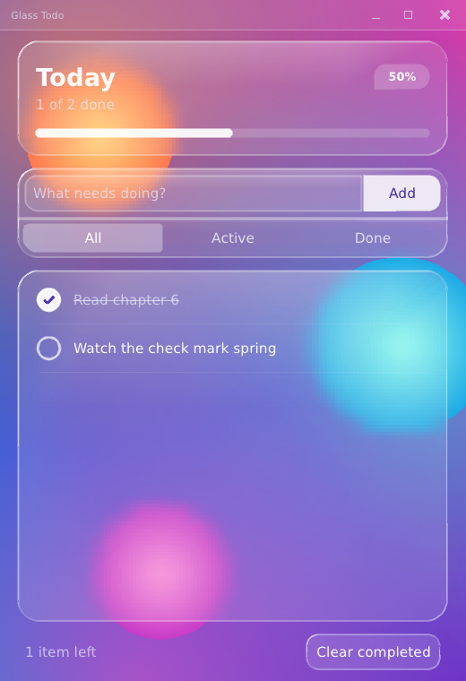
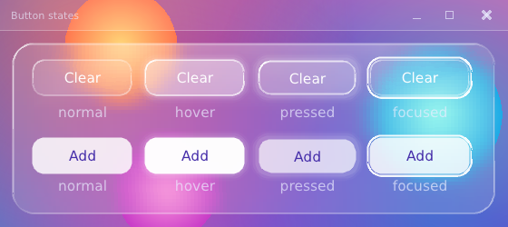

# 6. Motion and custom widgets

Goal: bring the glass to life. A progress bar that springs to its value, tasks that
slide in, a check mark that pops, a delete "x" that fades in when you hover a
row, a background that drifts — and, along the way, how to write your own widget.

← [5. Liquid glass](05-liquid-glass.md) · [Tutorial index](README.md) · next: [7. Polish and structure](07-polish-and-structure.md)

Program: `step06_motion.cpp`, widgets in `glass_widgets.h`. Run `pui_tut_step06_motion`.



## How animation works with no widget objects

In a retained toolkit you start an animation object and it ticks until done. In an
immediate-mode program there is nothing to start. Instead an animation is a
**value that moves toward a target, kept under a key**, and you ask for it every
frame:

```cpp
const f32 t = u.animate("fill"_id, target, tween{0.25f});   // each frame
draw_something(t);
```

The first call creates the value at `0` (`smooth` starts at its target, so it never
jumps on first sight), each later call advances it by the frame time `dt` toward
the *current* `target`, and returns where it is now. Change the target any time — a click, a changed
filter — and the value just starts heading somewhere else, continuing smoothly
from where it was. There is no "start", "stop" or "cancel".

| Call | Behavior | Use it for |
|---|---|---|
| `u.animate(key, target, tween{duration, curve})` | fixed duration with an easing curve | fades, slides, anything with a known length |
| `u.animate(key, target, spring{stiffness, damping_ratio})` | physics; keeps velocity when retargeted | things that should feel alive: toggles, bounces |
| `u.smooth(key, target, half_life)` | exponential follow, frame-rate independent | tracking something that keeps moving; hover fades |
| `u.appear(key, duration, curve)` | `0 → 1` once, the first time the key is seen | "enter" animations |
| `u.animate_color(key, color, tween{...})` | the same, for a color | hover and state colors |

* **Springs:** a higher `stiffness` is snappier; `damping_ratio` `1.0` settles
  without overshoot, below `1` overshoots and wobbles (`0.55` is bouncy).
* **Easing curves:** `LINEAR`, `EASE_IN`, `EASE_OUT`, `EASE_IN_OUT`,
  `EASE_OUT_BACK` (overshoots a little).
* **Keys are ids**, scoped like widget ids: inside an `id_scope`, the same key text
  in two rows is two animations. (`animate_global` ignores the scope.)
* **They clean up after themselves.** A key not used for five seconds is
  forgotten.
* **They are time-based, not frame-based:** the amount moved depends on `dt`, so
  the speed is the same at 30 and 144 fps, and a long frame (dragging the window)
  just takes one bigger — still stable — step.
* **`u.set_reduced_motion(true)`** makes every animation jump straight to its
  target, for users who want no motion. Wiring it to the OS preference is the
  app's job.

## A progress bar that springs

In the header, the fill's width follows `frac` (done ÷ total) through a spring:

<!-- src: examples/tutorial/step06_motion.cpp -->
```cpp
// progress: a pill track and a pill fill whose width springs to the target
const rect bar = in.bottom_slice(10.0f);
const f32 frac = total > 0 ? static_cast<f32>(done) / static_cast<f32>(total) : 0.0f;
const f32 shown = u.animate("progress"_id, frac, spring{170.0f, 0.9f});
u.draw_rounded_rect(bar, color{255, 255, 255, 46}, bar.h * 0.5f);
const f32 w = bar.w * clampf(shown, 0.0f, 1.0f);
if (w > 0.5f)
    u.draw_rounded_rect(rect::make(bar.x, bar.y, max2(w, bar.h), bar.h),
                        color{255, 255, 255, 235}, bar.h * 0.5f);
```

`shown` lags behind `frac` and overshoots slightly, so ticking a task makes the bar
surge and settle instead of jumping. That is the entire change from chapter 5's
`frac`.

## A scene that drifts

`glass_background` already takes a time. Feed it the frame clock and the orbs
wander:

<!-- src: examples/tutorial/step06_motion.cpp -->
```cpp
glass_background(u, page, u.ctx->now);     // the scene drifts with the frame clock ...
u.request_redraw();                        // ... so keep frames coming even when idle
```

`u.ctx->now` is the frame time in seconds (the same number as `app.now`).

The second line deserves attention. PufferUI can **sleep when nothing changes**
— the loop waits for input instead of redrawing 60 times a second, so an idle app
uses almost no CPU. It decides "nothing is changing" from the keyed animations and
a few other things. But the drifting scene is *not* a keyed animation: it is just a
function of time. So we tell the library: **`u.request_redraw()`**, "something
moved this frame, keep going". Call it every frame the motion continues; the
frame that does not call it lets the app sleep again. (An app with no ambient
motion never needs to call it.)

## Writing your own widget

Everything so far used the library's widgets. The check marks and the delete
buttons are ours — and a widget is just a function. Its raw material is
`interact`:

```cpp
interaction in = u.interact(id, rect);
```

`interact` registers a hit area under an id and tells you what the pointer and
keyboard are doing to it this frame:

| Field | Meaning |
|---|---|
| `in.hovered` | the pointer is over it (and nothing on top is taking the input) |
| `in.held` | the button is currently pressed on it |
| `in.clicked` | released over it after pressing on it: **a click** |
| `in.activated` | the frame the press began (use this for drag anchors) |
| `in.double_clicked`, `in.right_clicked` | what they say |
| `in.focused` | it has keyboard focus (it is in the Tab ring automatically) |
| `in.blocked` | a popup or panel above it swallowed the input |

Then you draw whatever you like from that state. Keyboard activation (Enter/Space
on a focused widget) is one small helper we write once and reuse:

<!-- src: examples/tutorial/glass_widgets.h -->
```cpp
inline bool activated(ui &u, const interaction &in)
{
    const bool kb = in.focused && (u.key_pressed(key::ENTER) || u.key_pressed(key::SPACE));
    if (kb)
    {
        u.consume_key(key::ENTER);
        u.consume_key(key::SPACE);
    }
    return in.clicked || kb;
}
```

`u.consume_key(k)` marks a key "handled" for the rest of the frame, so two widgets
cannot both react to one Space press.

### The check mark

<!-- src: examples/tutorial/glass_widgets.h -->
```cpp
inline bool glass_check(ui &u, rect r, bool &value, uiid id, f32 k = 1.0f)
{
    const interaction in = u.interact(id, r);
    if (in.hovered) u.set_cursor(CURSOR_HAND);
    const f32 t = u.animate(id_child(id, "on"_id), value ? 1.0f : 0.0f, spring{380.0f, 0.55f});
    const vec2 c{r.center_x(), r.center_y()};
    const f32 rad = min2(r.w, r.h) * 0.5f - 2.0f;
    const color white{255, 255, 255, 255};
    u.draw_arc(c, rad - 0.8f, 1.6f, 0.0f, 2.0f * PI, fade(white, (in.hovered ? 0.95f : 0.7f) * k));
    if (t > 0.01f)
    {
        // a disk is a rounded rect whose radius is half its size
        const f32 dr = rad * clampf(t, 0.0f, 1.15f);
        u.draw_rounded_rect(rect::make(c.x - dr, c.y - dr, dr * 2.0f, dr * 2.0f),
                            fade(white, clampf(t, 0.0f, 1.0f) * 0.92f * k), dr);
        const color tick = fade(color{82, 56, 190, 255}, clampf(t, 0.0f, 1.0f) * k);
        u.draw_line(c.x - rad * 0.38f, c.y + rad * 0.02f, c.x - rad * 0.10f, c.y + rad * 0.32f,
                    tick, 2.2f);
        u.draw_line(c.x - rad * 0.10f, c.y + rad * 0.32f, c.x + rad * 0.42f, c.y - rad * 0.28f,
                    tick, 2.2f);
    }
    if (in.focused) u.draw_arc(c, rad + 3.0f, 1.5f, 0.0f, 2.0f * PI, u.th().focus_border);
    if (activated(u, in))
    {
        value = !value;
        return true;
    }
    return false;
}
```

Read it as five small steps:

1. **`interact`**, and a hand cursor while hovered (`u.set_cursor`).
2. **The animated value `t`** springs from 0 to 1 as `value` becomes true. The
   spring is **keyed by `id_child(id, "on"_id)`** — a new id derived from the
   widget's own — so each checkbox has its own spring.
3. **The outline** is `draw_arc` (a full circle), dimmer unless hovered.
4. **When `t > 0`:** a **disk** — a rounded rect whose radius is half its size,
   scaled by `t` (it overshoots past 1 because the spring does: that is the "pop") —
   and the **check mark**, two diagonal `draw_line` calls whose alpha is `t`.
5. **Focus ring and activation.** A ring if focused; if `activated(...)`, flip
   `value` and report the change.

The last parameter `k` is an overall opacity: the row passes its enter animation
here so the whole widget fades in together.

### The delete button that appears on hover

<!-- src: examples/tutorial/glass_widgets.h -->
```cpp
inline bool glass_delete(ui &u, rect r, uiid id, bool row_hot, f32 k)
{
    const interaction in = u.interact(id, r);
    if (in.hovered) u.set_cursor(CURSOR_HAND);
    const f32 show =
        u.smooth(id_child(id, "show"_id), (row_hot || in.focused) ? 1.0f : 0.0f, 0.06f);
    if (show > 0.02f)
    {
        const vec2 c{r.center_x(), r.center_y()};
        if (in.hovered)
            u.draw_rounded_rect(rect::make(c.x - 13.0f, c.y - 13.0f, 26.0f, 26.0f),
                                color{255, 255, 255, 40}, 13.0f);
        const color x = fade(color{255, 255, 255, 255}, show * (in.hovered ? 1.0f : 0.7f) * k);
        u.draw_line(c.x - 4.5f, c.y - 4.5f, c.x + 4.5f, c.y + 4.5f, x, 1.8f);
        u.draw_line(c.x - 4.5f, c.y + 4.5f, c.x + 4.5f, c.y - 4.5f, x, 1.8f);
        if (in.focused) u.draw_arc(c, 15.0f, 1.5f, 0.0f, 2.0f * PI, u.th().focus_border);
    }
    u.tooltip(r, id_child(id, "tip"_id), "Delete");
    return activated(u, in);
}
```

The "x" is *always there* — it is in the Tab ring and clickable — but drawn only
as visible as `show`, which `smooth` eases toward 1 while the row is hovered or the
button is focused. (Keyboard users see it the moment they Tab onto it.) The two
`draw_line` calls make the cross; the faint circle under it appears on direct hover;
and `u.tooltip(...)` shows "Delete" after a short hover delay.

## A glass button: hover and press

The built-in button changes color per state (chapter 4). With a custom widget you
can make hover and press *feel* like something. The glass button blooms a soft
glow and brightens its rim when you hover it, and pushes itself in and dims when
you press it:



The trick is to split the widget in two. **Painting** takes the *amounts* of each
state (0 to 1) and draws one frame — no input in it at all, which is how the picture
above was made, by calling it with fixed numbers:

<!-- src: examples/tutorial/glass_widgets.h -->
```cpp
inline void glass_button_paint(ui &u, rect r, std::string_view label, const glass_button_style &st,
                               f32 hover, f32 press, bool focused)
{
    const color white{255, 255, 255, 255};
    // hover glow: three growing, fading layers behind the button
    for (i32 i = 3; i >= 1; --i)
    {
        const f32 g = static_cast<f32>(i) * 2.5f;
        u.draw_rounded_rect(r.pad(-g), fade(white, hover * 0.035f * static_cast<f32>(4 - i)),
                            grown(st.radii, g));
    }

    // pressed: the body shrinks a little and the fill dims
    const rect body = r.pad(press * 1.5f);
    const f32 base = st.accent ? 214.0f : 34.0f;
    const f32 lit = st.accent ? 250.0f : 74.0f;
    const f32 dim = st.accent ? 168.0f : 20.0f;
    f32 alpha = base + (lit - base) * hover;
    alpha = alpha + (dim - alpha) * press;
    u.draw_rounded_rect(body, color{255, 255, 255, static_cast<u8>(alpha)}, st.radii);

    if (!st.accent) // a rim that brightens with hover (the same light-following rim as the cards)
    {
        glass_style rim{.radii = st.radii};
        rim.rim_light = {255, 255, 255, static_cast<u8>(150.0f + 105.0f * hover)};
        rim.rim_dark = {255, 255, 255, static_cast<u8>(55.0f + 60.0f * hover)};
        rim.rim_width = 1.2f;
        glass_rim(u, body, rim);
    }

    rect text_r = body;
    text_r.y += press; // the label sinks with the body
    u.text(text_r, label, st.accent ? color{70, 46, 170, 255} : color{255, 255, 255, 250},
           ALIGN_CENTER);

    if (focused)
    {
        glass_style ring{.radii = grown(st.radii, 3.0f)};
        ring.rim_light = ring.rim_dark = {255, 255, 255, 235};
        ring.rim_width = 1.6f;
        glass_rim(u, r.pad(-3.0f), ring);
    }
}
```

* **The glow** is three rounded rects, each a little larger and fainter than the
  last, drawn *behind* the button; `hover` scales their alpha. (`grown` makes the
  radii of the bigger shapes match, and keeps square corners square.)
* **Press** shrinks the body by up to 1.5 px, dims the fill, and drops the label
  one pixel: it feels pushed in.
* **The rim** is the same `glass_rim` the cards use, with its brightness following
  `hover`.
* **The button takes `corner_radii`** like everything else, so the Add button can
  round only its right side next to the field.

**The live widget** feeds it real input. It asks `interact` what the pointer is
doing, eases the two amounts with `smooth` (so the highlight *fades* in a tenth of a
second instead of snapping), paints, and reports the click:

<!-- src: examples/tutorial/glass_widgets.h -->
```cpp
inline bool glass_button(ui &u, rect r, std::string_view label, uiid id,
                         const glass_button_style &st = {})
{
    const interaction in = u.interact(id, r);
    if (in.hovered) u.set_cursor(CURSOR_HAND);
    const f32 hover = u.smooth(id_child(id, "hover"_id), in.hovered ? 1.0f : 0.0f, 0.05f);
    const f32 press = u.smooth(id_child(id, "press"_id), in.held ? 1.0f : 0.0f, 0.03f);
    glass_button_paint(u, r, label, st, hover, press, in.focused);
    return activated(u, in);
}
```

That is the entire "hover effect": a number that eases toward 1 while
`in.hovered`, used in the drawing. Anything you can draw you can make react: scale a
card on hover, light up a row, reveal a menu. The Add and "Clear completed" buttons in
the app are this widget, and keyboard focus (Tab, then Space or Enter) works because
`interact` and `activated` handle it.

## The row, assembled

Now the row uses them. Compare with chapter 4's row (a stock checkbox and a stock
button): this one is everything above plus three more animation calls.

<!-- src: examples/tutorial/step06_motion.cpp -->
```cpp
inline void todo_row(ui &u, rect bounds, todo_item &t, unsigned &remove_id, bool &changed)
{
    id_scope scope = u.scope(t.id); // every id inside is this task's own
    const theme &th = u.th();

    // enter animation: 0 -> 1 once, the first time this task is seen
    const f32 k = u.appear(u.local("in"), 0.32f);
    bounds.y += (1.0f - k) * 10.0f;

    const bool hot = bounds.contains(u.ctx->mouse_x, u.ctx->mouse_y);
    if (hot) u.draw_rounded_rect(bounds.pad(3.0f, 2.0f), color{255, 255, 255, 16}, 14.0f);
    u.draw_line(bounds.x + 18.0f, bounds.bottom() - 0.5f, bounds.right() - 18.0f,
                bounds.bottom() - 0.5f, color{255, 255, 255, static_cast<u8>(22.0f * k)}, 1.0f);

    rect in = bounds.pad(14.0f, 0.0f);
    const rect check_r = in.cut_left(30.0f);
    (void)in.cut_left(12.0f);
    const rect del_r = in.cut_right(30.0f);
    if (glass_check(u, rect::make(check_r.x, check_r.center_y() - 15.0f, 30.0f, 30.0f), t.done,
                    u.local("check"), k))
        changed = true;

    const color text_c =
        u.animate_color(u.local("tc"), t.done ? th.text_dim : th.text, tween{0.2f});
    u.text_ellipsis(in, t.title, fade(text_c, k), ALIGN_LEFT);
    if (t.done) // strike-through, as wide as the text (or the room we have)
    {
        const f32 w = min2(u.text_width(t.title), in.w);
        u.draw_line(in.x, in.center_y() + 1.0f, in.x + w, in.center_y() + 1.0f,
                    fade(th.text_dim, k), 1.5f);
    }
    if (glass_delete(u, del_r, u.local("del"), hot, k)) remove_id = t.id;
}
```

* **`appear`** gives `k` going `0 → 1` the first time this task is ever drawn.
  The row slides up by `(1 − k) × 10` px and everything fades in with `k`.
* **Hover** is computed without `interact`: `bounds.contains(mouse)` against the
  context's pointer. That is deliberate — a hit area over the whole row would
  compete with the check and delete widgets for clicks. When a row is only
  *decorated* by hover, test the point; when it is *clicked*, use `interact`.
* **`animate_color`** eases the title between normal and dim as `done` changes.
* **The strike-through** is a line as wide as the text (`u.text_width`), clamped to
  the room available — a done task is dim *and* struck.
* **The row's separator** is a one-pixel line at the bottom whose alpha follows
  `k`.

Finally `todo_draw` is unchanged from chapter 5 except the scene call above. Run it,
tick a few tasks, delete one, add one, and Tab through the rows.

## What you learned

| Idea | One line |
|---|---|
| Animation | a keyed value moving toward a target; ask every frame, draw what you get |
| Spring vs tween | spring = physical, keeps velocity; tween = fixed time and curve |
| Appear | `u.appear(key, dur)` goes `0 → 1` once: enter animations for free |
| Custom widget | `interact` + animate + draw primitives, in an ordinary function |
| Idle | `request_redraw()` for motion the library cannot see |
| Hover decoration | `rect.contains(ctx->mouse_x, ctx->mouse_y)`; clicks use `interact` |
| Hover / press effect | `smooth` the amounts toward `in.hovered` / `in.held`; paint from the amounts |
| Paint vs input | a `*_paint(amounts)` function can draw any state without a pointer |

## Try it

1. Change the check spring from `{380, 0.55}` to `{380, 1.0}` (no overshoot) and
   to `{150, 0.3}` (wobbly). Which feels right?
2. Make new rows slide in from the left instead of from below.
3. Give the delete button an `animate_color` so the "x" turns red when hovered.
4. Animate the filter change: make the list fade in again when `s.filter` changes.
   (Hint: key an `appear` by `id_child("list"_id, filter)`.)
5. Comment out `u.request_redraw();` in `step06_motion.cpp` and watch the drifting
   scene: with nothing else changing, the app sleeps between events, so the drift
   steps a few times a second instead of gliding. Put it back.
