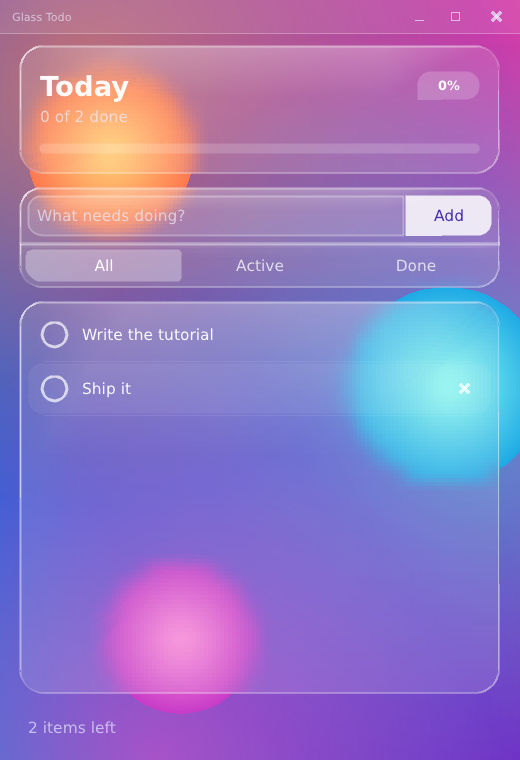

# Build a liquid-glass todo app with PufferUI

A step-by-step tutorial: from an empty folder to a polished, animated,
tested desktop app.



You will build this: a todo list whose cards are **frosted glass** — the colorful
scene behind them is blurred, tinted, edged with a light-catching rim — with
springy check marks, rows that slide in, a progress bar that fills, tasks that
persist between runs, and a test suite that runs without opening a window.

It is also a tour of how PufferUI works. By the end you will know the whole
mental model, and every piece of the app is small enough to read in one sitting.

## Who this is for

You can read basic C++ (functions, structs, `std::string`, `std::vector`,
references, lambdas). You do **not** need to know graphics, SDL, or GUI
frameworks, and you do not need to have used an immediate-mode GUI before —
chapter 2 explains what that means.

## The chapters

| # | Chapter | You will | Program |
|---|---|---|---|
| 1 | [Setup](01-setup.md) | install tools, build the library, open your first window | `step01_window` |
| 2 | [The frame loop and layout](02-frame-loop-and-layout.md) | learn immediate mode and *rect cutting*; lay out the page | `step02_layout` |
| 3 | [State and widgets](03-state-and-widgets.md) | model the tasks; text field, buttons, checkboxes, a scrolling list | `step03_tasks` |
| 4 | [Views and components](04-views-and-components.md) | filters, counts, an empty state, text styles, themes | `step04_filters` |
| 5 | [Liquid glass](05-liquid-glass.md) | background, backdrop blur, rim light, a glass theme | `step05_glass` |
| 6 | [Motion and custom widgets](06-motion-and-custom-widgets.md) | springs, fades, a hand-made checkbox, hover reveals | `step06_motion` |
| 7 | [Polish and structure](07-polish-and-structure.md) | persistence, focus, tooltips, splitting into modules | `todo` |
| 8 | [Testing and debugging](08-testing-and-debugging.md) | violations, the overlay, headless tests | `todo_test` |
| 9 | [Where next](09-where-next.md) | exercises, a cheat sheet, common pitfalls | — |

Every program is a real file under [`examples/tutorial/`](../../examples/tutorial/),
built by the project's CMake and run by CI (`--selftest`). The code blocks in the
chapters are excerpts of those files — each block says which file it comes from,
and `tools/check_tutorial.ps1` fails CI if a block drifts from its source. So if
a chapter shows it, it compiled and ran.

Each chapter ends with a **Try it** list. The exercises are small, and doing a few
is the quickest way to make the ideas stick.

## How the programs relate

```
step01_window   a window and a loop                     (no helper files)
step02_layout   + tut.h, rect cutting
step03_tasks    + todo_model.h, widgets, scrolling
step04_filters  + views, components, themes
step05_glass    + glass.h (the look)
step06_motion   + glass_widgets.h (custom widgets), animation
todo            the same app split into modules, persistence, polish
todo_test       tests for the model and the screen, no window
```

Files shared by several steps:

| File | What it is |
|---|---|
| `tut.h` | the frame loop (`tut_init` / `tut_loop` / `tut_shutdown`) plus `--selftest` and `--screenshot` flags. Chapter 1 writes the loop by hand; from chapter 2 it lives here. |
| `todo_model.h` | the data: tasks and the functions that change them. No UI in it. |
| `glass.h` | the *look*: background, glass card, rim, glass theme. |
| `glass_widgets.h` | custom widgets in the glass style: the round checkbox, the delete "x" and the hover/press button. |
| `todo_ui.h` | the finished screen, as functions of the app state. |

## Running things

Every step has a CMake target named `pui_tut_<name>` (for example
`pui_tut_step05_glass`). With the repository built as described in chapter 1:

```sh
cmake --build out/build/x64-release --target pui_tut_step05_glass
out/build/x64-release/Release/pui_tut_step05_glass.exe
```

Each program (except `step01_window`) also understands

| Flag | Meaning |
|---|---|
| `--selftest` | run offscreen with scripted input; exit non-zero on any contract violation |
| `--frames N` | how many frames `--selftest` runs (default 12) |
| `--screenshot FILE` | with `--selftest`: save the last frame as a BMP |
| `--size WxH` | initial window size |

## A note on honesty

PufferUI is young (0.1.x). Where something has a rough edge, the chapters say so
rather than hide it, and chapter 9 lists the ones you are most likely to meet.
Writing this tutorial exercised the library hard enough to find three things,
all fixed with regression tests: a translucent text field painted its border color
through its background, a spring animation could blow up on a very long frame,
and an ambient animation (the drifting scene) had no way to keep the idle-sleeping
loop awake, which is why `u.request_redraw()` now exists (chapter 6).
